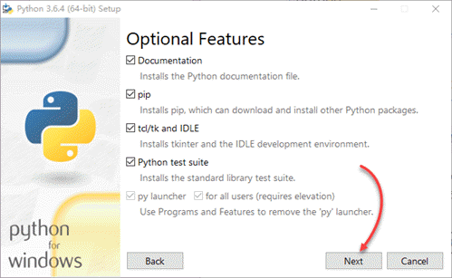

在 Windows 中，Python 的安装似乎非常简单，按大多数教程的说法，只需从 [Python.org](https://www.python.org/) 下载适用于你的操作系统的安装程序，然后运行这个安装程序，在安装界面上启用 Add Python 3.6 to PATH，再单击 Install Now，即可完成安装：


不过，这种 “简单” 的安装方式，实质上是在用户级别上安装 Python，最终的安装位置位于当前用户目录下（如 C:\Users\\<username\>\AppData\Local\Programs\Python\Python36\），其结果是只有当前用户能够使用 Python。一旦你以其它用户登录 Windows，运行 python 命令将出现如下错误提示：

```cmd
'python' 不是内部或外部命令，也不是可运行的程序或批处理文件。
```

本文将了解在 Windows 10 64-bit 平台上安装系统级 Python 的方式，做到一次安装多用户可用；同时也将探究 Python 虚拟环境和包管理的最佳实践，以便最大限度地减少今后项目开发过程中可能遇到的潜在障碍。

> 提示：Python2已确定于1月1日停止，除非确实需要，否则不要再使用Python2。
<!-- more -->

# 在系统级上安装 Python

如果你需要在系统级上安装 Python，以便多个 Windows 帐户均可使用 python，则必须在安装时采用自定义的方式。安装步骤如下：

1. 以管理员帐户登录 Windows，运行 Python 安装程序，并选择 Customize installation：
    

2. 保持 Optional Feature 的默认选择，并单击 Next：
    

3. 在 Advanced Options 中，启用 Install for all users 及 Add Python to environment variables，然后单击 Install 开始安装：
    

4. 安装完成后，在管理员和非管理员用户中，运行 “命令提示符” ，并输入如下命令查看刚刚安装的 Python 及 pip 的版本号：
    ```cmd
    C:\Users\<username>python --version
    Python 3.6.4
    C:\Users\<username>pip --version
    pip 9.0.1 from c:\program files\python36\lib\site-packages (python 3.6)
    ```

一切顺利的话，你就可以在多个 Windows 用户中使用 Python 了。

> **提示**：如果你打算执行全新的安装，则应在卸载 Python 后，再删除原来的安装目录及其中可能遗留的包。

# 虚拟环境与包管理

使用 Python 进行开发时，根据项目性质的不同，不可避免地需要安装和使用各种第三方库。例如，在 Web 开发中，你可能会使用 Django、Flask 等，而在做数据分析时，又可能需要 numpy、pandas 等。并且，即使是同一个第三方库，不同版本之间也可能出现不兼容的现象。

如果把所有的第三方库都直接安装到全局的 Python 环境中，势必会造成不必要的混乱和冗余，第三方库的不兼容版本也可能导致原来正常的项目无法运行。更严重的是，对于 Linux 等自带 Python 的系统，甚至可能因系统级的第三方库被不兼容的新版本覆盖，而造成整个系统的崩溃。此外，在项目告一段落后重新启动开发、或者是需要多人协作时，重建一个完全一致的开发环境即使不是不可能，也将面临极大的困难。

解决上述问题的办法是，为每一个项目创建一个虚拟环境，并在其中只安装与项目直接相关的各种库及其依赖。这样，可确保各项目的依赖彼此隔离，不会相互影响，同时也避免了对系统级的 Python 环境造成污染或破坏。

多年来，Python 社区在虚拟环境及包管理方面开发和积累了大量工具，如 easy_install、pip、virtualenv、virtualenvwrapper、virtualenv-burrito、autoenv、pyenv、pyvenv 等等，甚至 Python 3 还加入了一个名为 venv 的标准库。在这些工具中，最经典且广泛使用的是 pip 和 virtualenv，前者用于管理第三方包，而后者用于管理虚拟环境。

如果你对这些工具及其名称感到眼花缭乱，无所适从，别担心……创建于 2017 年 1 月的 pipenv 结束了虚拟环境及包管理方面的混乱局面。

# Pipenv 入门

[Pipenv](https://github.com/pypa/Pipenv) 整合了 pip 和 virtualenv 的功能，简化了操作，旨在成为 Python 项目最好的依赖管理器。Pipenv 自诞生以来发展迅速，目前已成为 Python 官方推荐的包管理工具。

Pipenv 能够为你的项目自动创建和管理虚拟环境，并在你安装 / 卸载包时，在 Pipfile 中添加 / 移除相关的条目。它甚至能够生成更重要的 Pipfile.lock，从而精确再现开发环境。

## 安装 pipenv

作为创建每个项目不可或缺的依赖管理器，Pipenv 几乎是安装 Python 之后的第一个必装工具。不过，为避免 pipenv 所依赖的包破坏系统级上的同名包，最好在用户级上安装 pipenv。

以你的 Windows 帐户登录系统，运行如下命令来确认系统中已安装了 pip，然后安装 pipenv：

```cmd
C:\Users\username>pip --version
pip 9.0.1 from c:\program files\python36\lib\site-packages (python 3.6)
C:\Users\username>pip install --user pipenv
```

> 使用国内源？

命令中的 `--user` 参数表示在用户级上安装 Pipenv。安装完成后，尝试运行如下命令查看 pipenv 的版本号：

```cmd
C:\Users\username>pipenv --version
'pipenv' 不是内部或外部命令，也不是可运行的程序或批处理文件。
```

刚刚安装的 pipenv 居然无法使用？原来，执行用户级安装时，pipenv 将被安装到 C:\Users\username\AppData\Roaming\Python\Python36\Scripts 中。要想能够直接运行 pipenv，必须将这个路径添加到用户的环境变量中。

> **提示**：运行如下命令，可查看用户级的包路径，将最后的 `site-packages` 替换为 `Scripps`，就是用户级可执行文件（包括 pipenv）的安装位置。
>    ```cmd
>    C:\Users\username>py -m site --user-site
>    C:\Users\username\AppData\Roaming\Python\Python36\site-packages
>    ```

进入 “控制面板 | 用户帐户 | 用户帐户”，单击左侧的“更改我的环境变量”（如下图），打开当前用户的“环境变量” 对话框，在上方的用户变量列表中选择 Path 并单击 “编辑...”，添加 `C:\Users\username\AppData\Roaming\Python\Python36\Scripts` 后，依次点击各对话框的“确定”来确认修改：


> 提示：在开始菜单中搜索“环境变量”，并单击找到的“编辑帐户的环境变量”，可以快速打开当前用户的“环境变量” 对话框。

重新启动命令提示符，再次查看 pipenv 的版本，可发现刚刚设置的用户环境变量已经生效：

```cmd
C:\Users\username>pipenv --version
pipenv, version 11.8.3
```

## pipenv 基本操作

使用 pip 和 virtualenv 的话，必须先创建虚拟环境，然后激活，再用pip安装所需的包……非常烦琐且经常忘记激活……pipenv则非常简单，下面实例演示如何安装pywinauto……

pipenv 按项目来管理依赖。要安装项目依赖包，可运行如下命令，进入项目目录（本例使用了一个空目录），并安装所需的库——试试pywinauto：


[Pipenv & Virtual Environments — The Hitchhiker's Guide to Python](http://docs.python-guide.org/en/latest/dev/virtualenvs/)

关于 pipenv 的更多信息，后方再说……
[pipenv 新款Python虚拟环境工具详解-刘江的博客](http://www.liujiangblog.com/blog/18/)
[How to manage your Python projects with Pipenv](https://robots.thoughtbot.com/how-to-manage-your-python-projects-with-pipenv)
[How to use pipenv in your python project - jcutrer.com](https://jcutrer.com/howto/dev/python/pipenv-pipfile)可改变.venv位置……
---
以下另文……

## Pipenv 基本用法

[使用 Pipenv 管理你的项目](https://zhuanlan.zhihu.com/p/32913361)
[Pipenv 更优雅的管理你的 python 开发环境 - PyLixm'Wiki - SegmentFault 思否](https://segmentfault.com/a/1190000012837890)
[使用 Pipenv 来管理你的 Python 项目_Python_第七城市](http://www.th7.cn/Program/Python/201801/1303564.shtml)

## 安装第三方库

先创建虚拟环境……
安装第三方库，以 pywinauto 为例：
一般应安装到虚拟环境中——首先创建并激活虚拟环境，然后再运行 pip install pywinauto。
如果想安装到 python“总库”，则同样需要管理员帐户并以管理员身份运行 cmd……

另外，PowerShell 不允许激活虚拟环境，怎么回事？

* 要么得回右键 cmd——任务栏属性，关掉：当我右键单击 “开始” 按钮或按下 Windows 键 + X 时，在菜单中将命令提示符替换为 Windows PowerShell……Shift + 右键仍然不行，需要改注册表……[Win10 系统将 “此处打开 PowerShell 窗口” 更改为 “在此处打开命令窗口”-- 系统之家](http://www.xitongtiandi.net/wenzhang/win10/13189.html)
* 要么改 PowerShell……Set-ExecutionPolicy -Scope CurrentUser
* 最简单的办法是在 PowerShell 中运行 cmd！！！！

在Windows上安装Anaconda……[Python Tutorial: How to install Anaconda3 (Python 3.5) for Windows - jcutrer.com](https://jcutrer.com/howto/dev/python/python-tutorial-howto-install-anaconda3-python-windows)