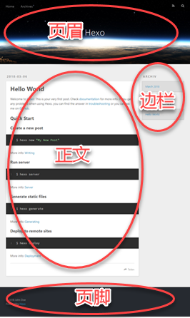

在  一文中，你了解到了如何搭建 Hexo 博客站点并部署到远程仓库，实现了博文源码及站点配置的备份，并且还探讨了如何在多个设备上同步博客站点。

本文主要包括两方面的内容，首先是了解 Hexo 中与写作的相关事项和概念，其次是介绍如何利用 Visual Studio Code 来打造一个专注无干扰的 Markdown 写作环境。读完本文，你就可以做到心无挂碍、高效流畅地撰写你的博文了。
<!--more-->

# Hexo 的常规写作方式

现在，先来了解一下 Hexo 的常规写作方式，顺便了解 Hexo 的一些非常重要的概念。

按 [Hexo 官方文档](https://hexo.io/zh-cn/docs/writing.html) 的说明，创建新博文的命令如下：

```bash
$ hexo new [layout] <title>
```

运行这个命令，即可为新博文创建一个 Markdown（.md）文件。并且，若此时启动 Hexo 本地服务器，也可看到博文已经添加到站点中了。这个命令有两个选项：

* `layout`：为新博文指定布局，未指定时默认采用 post 布局。其余两个布局选项分别是 draft 和 page。
* `title`：指定新博文的文件名，同时也是新博文在页面上最初显示的标题。若指定的标题中包含空格，则必须包围在一对半角双引号中（建议总是加上双引号，省心）。标题也可以是中文，不过英文的文件名兼容性更好。此外，Hexo 会自动将文件名中的下划线（_）自动更改为连字符（-）。

## 关于 Hexo 的布局

所谓的 **布局（layout）**，就是博文最终呈现出来的外观排版。如下图所示，你在每篇博文中输入的内容，将被 “嵌入” 到最终页面的 “正文” 位置。而正文之外的其它内容，如页眉、页脚及边栏等，则由 Hexo 根据你指定的布局及站点主题自动生成。



某种布局最终呈现出来的版面外观效果，由当前主题的 layout 文件夹中的同名 .ejs 文件定义。在生成最终的静态页面时，Hexo 会自动把每一篇博文 “嵌入” 到相应的 .ejs 布局中——\_posts 中的博文嵌入 post.ejs 布局，\_drafts 中的博文嵌入 draft.ejs 布局，而 page 博文则采用了 page.ejs 布局。

当然，最终的版面效果取决于你使用的主题。不同的主题定义了不同内容的 .ejs 文件集，而你的博文，总是 “一如既往” 地嵌入到相应的布局中的某个位置。这，也是你能够随心所欲地切换站点主题的原因。

作为测试，运行 `hexo n "test"` 命令创建一篇博文，观察 Hexo 自动在 source\\_post 文件夹中生成名为 test.md 的文件。启动 Hexo 服务器并在浏览器中查看本地站点和博文，观察并体会博文与其它布局元素之间的关系。

## 关于 Hexo 的模板

在你的编辑器中打开刚刚生成的 test.md 文件，可发现文件中已包含如下内容：

```yml
---
title: test
date: 2018-03-07 14:45:03
tags:
---
```

两个 `---` 及它们之间的内容，就是所谓的 **front matter**，用于保存关于博文的元数据。除博文标题及创建时间外，还可以在这里指定博文的标签、类别、关键字等等。完整的 front matter 参数及用途，请参阅 [Hexo 文档](https://hexo.io/zh-cn/docs/front-matter.html)。

这些 front matter 源自于 Hexo 的模板。在创建博文时，Hexo 将根据你指定的 `layout`，自动对博文应用 scaffolds 文件夹中的相应模板。由于刚才创建博文时采用了默认的 post 布局，因此 Hexo 将自动套用 scaffolds\\post.md 模板来生成 test.md。

在编辑器中打开 scaffolds\\post.md 模板，可发现其中包含与 test.md 中对应的 front matter。当然，双花括号之间的 `title` 和 `date`，已被自动替换为新博文的标题和创建时间：

```yaml
---
title: {{title}}
date: {{date}}
tags:
---
```

Hexo 的默认模板比较简陋，你可以根据实际需要在模板中增加常用的元数据，如更新时间、类别及关键字等，以便在今后创建博文时，自动生成更完整的 front matter。例如：

```yaml
---
title: {{title}}
date: {{date}}
updated: {{date}}
tags:
categories:
keywords:
---
```

回到 test.md，把 front matter 中双花括号中的 `title` 修改为 `博文测试 `，并在后一个 `---` 之后随便输入一些内容作为博文的正文。告一段落后，在浏览器中刷新博客站点，可发现新博文的标题和内容也随着更新了。可见，Hexo 服务器能够自动监视博文内容的改变，并且无需重启。

> **提示**：博文的页面标题不必总是与文件名保持一致。随着你撰写越来越多的博文，你会发现现实中往往如此。即使是 Hexo 默认提供的 “Hello World” 博文，其文件名也是不一致的 “hello-world.md”。

## 关于标签和类别

当你的博文数量越来越多的时候，你或你的读者要怎样才能快速找到想要阅读的博文呢？Hexo 通过标签和类别提供了两种归类和检索博文的方式。

标签通常是从博文内容提炼的一个或多个关键词。你可以在 front matter 的 `tags:` 节点中，按如下方式为每一篇博文指定一个或多个标签：

```yaml
# 若只有单个标签，则在同一行中指定（注意冒号后有一个空格）
tags: hexo
# 若需要多个标签，则以多行方式指定
tags:
- hexo
- git
```

指定标签后，刷新站点页面，即可在侧边栏看到 “标签” 栏目。单击该栏目中的某个标签，将列出所有含有该标签的博文的链接；单击任一链接，即可打开并阅读相应的博文。

除标签外，你还可以从另一维度给你的博文分类。在 front matter 中增加 `categories:` 节点，并指定博文所属的一个或多个类别。同样，刷新站点可马上看到 “分类” 栏目：

```yaml
# 若只有单个类别，则在同一行中指定（注意冒号后有一个空格）
categories:
# 若需要多个类别，则以多行方式指定
categories:
- 实用工具
- Hexo
```

需要注意的是，与多个标签并无主次之分不同，多个类别间具有层级关系。首先列出的类别为一级类别，后续列出的类别依次为其前面类别之下的子类别。以上面的多类别设置为例，页面上将把 “Hexo” 类别缩进显示在 “实用工具” 类别之下，表示 “Hexo” 是 “实用工具” 中的一个子类别。

> **提示**：不同的主题，可能采用不同的方式来呈现类别，例如，Hueman 主题将以菜单的形式来显示类别。

## 关于 draft 和 page

前面提到，创建新博文时，还可以选择 draft 和 page 布局。难道，除了写博文之外，你还需要写别的什么吗？

是的。你还可以使用 draft 布局来创建草稿或不想公开发表的博文，而 page 布局则可为你的博客站点增加功能性的页面。

实际上，新建博文命令的 `layout` 参数也决定了新生成的博文的存放位置。采用 post 布局的博文文件将自动存放到 source\\_posts 文件夹中，draft 博文存入 source\\_drafts 文件夹，而 page 页面则直接存放在 source 文件夹中。

假设你突然产生了一个想法，但还不够成熟，也暂时没时间将其写成正式的博文，那么，你可以用 `hexo n draft "my-idea"` 来创建一篇草稿，并在其中快速且粗略地记下这个想法。当然，你也可以利用这个草稿来收集相关的资料。

> **提示**：如果你跟我一样，希望每次新建博文都从草稿开始，则可在站点配置文件中，把 `default_layout` 设置为 `draft`。这样运行 `hexo n "<filename>"` 命令就将直接创建草稿，而不是正式的博文。

默认时 Hexo 不会在站点中显示草稿，也不会在远程仓库中公开发布（放心，只是没有公开发布到 master 分支而已，草稿的源码依然会备份到 src 分支）。在逐步润饰完善草稿的过程中，如果你想要预览草稿的效果，只需在启动 Hexo 服务器时加上 `--drafts` 参数，如 `hexo s --drafts`，即可让本地站点同时显示出所有草稿和博文。

最后，当你打算把草稿发布为正式的博文时，运行 `hexo publish "<filename>"` 命令来把把指定的草稿从 source\\_drafts 中转移到 source\\_posts 中，并自动填写发布时间。从这时候起，这篇草稿就会像普通的博文一样公开发布了。

> **警告**：不要把站点配置中的 `render_drafts` 设置为 `true`，这将导致所有草稿也被公开发布，除非你想公开尚未完成的或隐私的博文。

至于使用 page 布局来生成功能性页面方面，给站点添加 “关于我” 的页面，就是一个很好的例子。运行如下命令来创建自我介绍页面：

```bash
hexo n page "about"
```

Hexo 自动在 source 文件夹中生成 about\\index.md 文件。在编辑器中打开该文件，并输入你的简介，完成后保存。然后，打开主题配置文件（例如themes\\landscape\\_config.yml），并在 `menu` 中添加 `About: /about` 菜单。如下：

```yml
menu:
  Home: /
  Archives: /archives
  About: /about
```

现在，你已经掌握了 Hexo 中与博文相关的基本概念了。遵循简洁轻便低入侵性的 Markdown 语法，你可以开始 “专注无干扰” 地撰写你的博文了。

> **提示**：Markdown 是一种轻量级的纯文本标记语言，只需输入少量标记，即可生成格式优美的印刷级排版。如果你还不了解 Markdown，可参考 [Markdown 快速入门](http://wowubuntu.com/markdown/basic.html)。

# 用 Visual Studio Code 撰写博文

专注无干扰？没错，Markdown 语法本身的确简洁流畅，但在创建、编辑和预览博文的过程中，既要运行 Git Bash 并输入命令，又要在文本编辑器中一层层寻找并打开文件，还是会时不时打断写作思路的。

说得好！你已经想到了，但你还不知道，你需要使用 **Visual Studio Code**。

Visual Studio Code（后称 VS Code）是微软出品的一个跨平台、轻量级且功能强大的代码编辑器，原生支持 JavaScript、TypeScript 及 Node.js，并且可通过扩展（即插件）来支持 C++、C#、Java 及 Python 等几乎所有语言，当然也包括你在 Hexo 中撰写博文所使用的 Markdown 语言。VS Code 一经推出即好评如潮，是文本或代码编辑器的不二之选。

> **提示**：访问 [VS Code 官方站点](https://code.visualstudio.com/) 来获取更多相关信息。

近年来，各种各样的 Markdown 编辑器层出不穷，在线的离线的都有。在我们的情形中，VS Code 之所以能够脱颖而出，是因为 VS Code 在界面中集成了一个终端，默认配置为使用 Windows PowerShell。在这个集成终端中，你可以输入并执行任何命令，无论是你已渐渐熟悉的 `hexo` 命令、还是 `git` 命令，以及 Node.js 的 `npm` 命令，都可以信手拈来。

> **提示**：如果你希望使用其它终端（比如 Git Bash），则可在 VS Code 中按下 F1 键打开 “命令面板”，输入 `Select Default Shell` 后回车，然后从清单中选择 Git Bash 即可。

有了这个多才多艺的 VS Code，你就可以进入真正 “专注无干扰” 地撰写博文的禅境了。

## 进入写作禅境

启动 VS Code，选择 **文件 | 打开文件夹** 打开你的博客站点文件夹。

按下 **Ctrl+\`** 激活 VS Code 下方的 “终端” 面板，输入 `hexo n "myblog"` 并回车。片刻之后，source\\\_posts 中就生成了 myblog.md 文件。

> **提示**：你应该已经了解到，几乎所有的 Hexo 命令都有对应的简化版本，例如 `hexo n` 相当于 `hexo new`、`hexo s` 相当于 `hexo server` 等等。关于完整的 Hexo 命令清单，请参阅 [Hexo 文档](https://hexo.io/zh-cn/docs/commands.html)。

按下 **Ctrl+P** 激活 VS Code 的 “快速打开” 面板，并输入刚刚创建的文件名 `myblog`，从弹出的清单中选择 “myblog.md source\\\_posts” 并回车，VS Code 随即在编辑器窗口中打开这个文件。

接下来，想必你已经知道了，不外乎就是像平常一样修改 front matter，遵循 Markdown 规则来撰写你的博文了。

如果想预览博文，可按下 **Ctrl+K, V** 打开 VS Code 自带的 Markdown 预览窗口。当然了，你在这里看到的，只是博文本身内容的预览。

如果想预览整体效果，可激活终端并执行 `hexo s -o`，启动 Hexo 本地服务器并自动在默认浏览器中打开博客站点（这是 `-o` 选项的效果）。

> **提示**：启动 Hexo 服务器后，当前的终端就被占用了。如果需要执行其它命令，同时又不想按下 **Ctrl+C** 来关闭 Hexo 服务器，则可按下 **Ctrl+Shift+\`** 来打开一个新的集成终端（终端面板右上角的下拉列表，可用来在不同的终端间切换）。

你可能已经注意到了，到现在为止，你的手还没有离开过键盘！

在 VS Code 中，一切都在你的指尖。大多数情况下，你都不用中止输入，不必腾出手来抓住鼠标到处寻找和点击——这不但影响了你的效率，也干扰了你的思路。

如果你足够细心的话，你会发现 VS Code 侧边栏的 “源代码管理” 图标上，叠加了一个带有数字的圆点。这意味着 VS Code 内置的 Git 检测到了当前站点与远程仓库之间存在未同步的内容。不过，远程仓库的管理和站点的部署，仍然必须使用 Hexo 的 deploy 命令。因为，在部署到远程仓库之前，Hexo 还执行了大量的操作，包括博文内容与布局的合成，以及生成最终的静态 HTML 文件等。

当你完成了新博文的编辑，或者是修改了站点的配置之后，就可以执行一次清理，并通过部署来发表博文和备份站点。依然是激活集成终端，然后输入并执行如下命令——你还是不用离开键盘：

```bash
$ hexo clean
INFO  Deleted database.
...
$ hexo d -g
INFO  Start processing
...
```

至此，你已渐渐进入撰写博文的禅境。一切纷扰离你而去，万籁俱寂之中，你正全神贯注、心无旁骛地让你的思想和见解，静静地经由你的指尖流淌出来……

## 继续扫清障碍

你已经能够专注无干扰地撰写博文了。不过，前行的路上，多少还有一些小障碍需要克服。在 Markdown 方面，VS Code 扩展市场中存在若干插件，适当的利用可进一步提高你的写作效率和质量。

### markdownlint

markdownlint 是一个 Markdown 语法检查器。博文中不符合 Markdown 规范的内容将被标上波浪线，并提供相应的改进提示。这个扩展可确保你的博文具有更高的兼容性（可由 Hexo 之外的其它 Markdown 解析器顺利读取），同时也可帮助你形成规范的语法习惯。

> **提示**：按下 **Ctrl+Shift+X** 在侧边栏打开 “扩展” 面板，输入扩展名称即可自动执行搜索，找到所需扩展后，单击其右下角的 “安装” 按钮并耐心等待。安装完成后出现 “重新加载” 按钮，单击即可让新安装的扩展马上生效。

### Markdown Shortcuts

顾名思义，这个扩展为 VS Code 提供了一组插入 Markdown 标记的快捷键。尽管 Markdown 与 HTML 相比已非常简洁，但插入链接（`[a hyperlink](www.example.org)`）或图像（``）的标记仍然颇为复杂，尤其是在使用中文输入法时，时常会因忘记切换全角半角标点符号而反复犯错，极大地影响了输入的流畅性。安装此扩展后，只需：

* 按下 **Ctrl+L**，然后，若已选定了链接文本，则直接粘贴事先复制好的目标URL；否则填入链接文本后再粘贴URL。
* 要插入 Markdown 图像标记，可使用 **Ctrl+Shift+L** 快捷键。更多信息，靖参阅该扩展主页上的 “详细信息”。

> **提示**：如果你使用 Chrome 浏览器的话，也可考虑使用名为 [copy-as-markdown](https://github.com/chitsaou/copy-as-markdown/) 的浏览器扩展，来直接从浏览器上获取 Markdown 格式的链接。

Hexo 在图像路径解析方面似乎存在问题，在 VS Code 预览中正常显示的图像，往往无法显示在远程发布后的页面上，反之亦然。一种比较简明的解决方法是：把所有图片放入 source\\imgs 文件夹中，在站点配置文件中设置 `permalink: :title/`，同时在博文中以 `../imgs/example.png` 的形式引用图像。这样，预览和发布的博文就都可以正确显示图像了。

### VS Code-pangu

这是一个非常简单的插件，用于在中文和英文字符之间插入一个空格，让最终的排版结果更美观。安装 VS Code-pangu 后，只需按下 **F1**、输入 `Why not add a space...` 并回车，即可给全文或选定的内容自动插入空格。

Hexo 也有一个可以自动插入空格的插件 [hexo-filter-auto-spacing](https://github.com/hexojs/hexo-filter-auto-spacing)，安装该插件后再在站点配置文件中设置 `auto_spacing: true` 即可使用。

不过，并非所有的中英文之间都适合插入空格，例如加粗的中文 `**提示**` ，自动插入空格后，最终的输出会变成 `** 提示 **`，失去加粗效果。因此，使用 VS Code-pangu 的可控性更好，可以在编辑器中更正不适当插入的空格。

> **注意**：如果一次性在全文中插入了空格，则应在发布前进行检查，并删除掉意外插入的不必要的空格。

### Markdown Preview Enhanced

改善了 VS Code 的 Markdown 预览，可显示博文目录方便导航，并支持输出 HTML、PDF、eBook 等格式。

### Hexo tag snippets

除标准的 Markdown 标记外，博文中也可以使用 Hexo 的 [自定义标记](https://hexo.io/zh-cn/docs/tag-plugins.html)。例如，下面的标记，可用于在博文中插入站内博文链接：

```hexo

```

不过，要注意这些标签只有在 Hexo 才能正确解析，其它 Markdown 解析器很可能无法解析这些标记（实际上，VS Code 的预览就无法解析这些标记），因此应尽量慎用。

如果确实需要使用 Hexo 标记，你可以安装名为 **Hexo tag snippets** 的 VS Code 扩展。该扩展把 Hexo 标记定义为代码片段，只需简短的输入几个字符，就可快速输入这些标记。例如，输入 `hcb` 并选择 “Code Block - General (Hexo tag snippets)”，可快速插入如下的代码块标记：

```javscript



```

默认时，VS Code 并未启用 Markdown 的智能感知。要在撰写博文时使用代码片段的功能，需要添加如下用户配置：

```json
"[markdown]": {
    "editor.wordWrap": "on",
    "editor.quickSuggestions": true
},
```

> **提示**：对于 Markdown 来说，智能感知有利有弊。若感觉你的写作受到影响，并且你的博文内容只需要少量 Hexo 标记，则不要启用该功能。

此外，你还可以在 VS Code 中定义你自己的代码片段。选择 **文件 | 首选项 | 用户代码片段**，打开 markdown.json 并输入如下内容，就可以使用 `hxpl` 和 `hxrm` 来快速插入站内博文链接和博文摘要的代码片段了：

```json
"hexo post link": {
  "prefix": "hxpl",
  "body": [
    "$0"
  ],
  "description": "Link to blog article"
},

"hexo readmore": {
  "prefix": "hxrm",
  "body": ["<!--more-->",
    "$0"],
  "description": "read more"
}
```

以上内容说明，除集成终端外，VS Code 强大的扩展能力，是又一个让它完胜其它 Markdown 编辑器的特性。扩展的可能性是无穷的，并且会随着时间的推移和社区的反馈而越来越好用。甚至，有必要的话，你还可以编写你自己的扩展。

# 尾声

经过一番跋涉，你终于达到了撰写博文的新境界。放松下来后，你可能会觉得 Hexo 的默认主题有些乏味。

如果想要以全新的面貌来呈现你的博文，可访问 [Hexo 官方网站的主题页面](https://hexo.io/themes/)，找到你喜欢的主题，并按其说明把主题下载（通常是使用 `git clone` 命令）到 themes 文件夹中；然后在站点配置文件中，把 `theme: landscape` 中的 `landscape` 修改为新主题的名称。

大多数主题在其自身文件夹中提供了 _config.yml 配置文件。利用这个主题配置文件，可以对主题的各种细节进行设置和调整。

本篇到此为止，享受你的写作吧！
