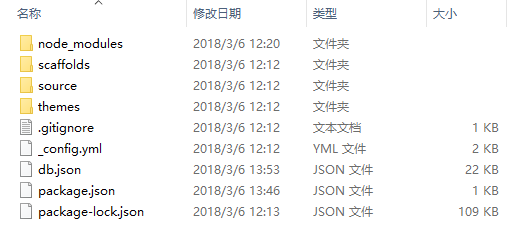
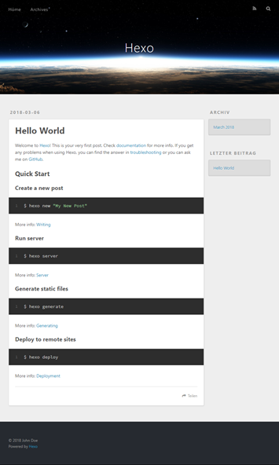
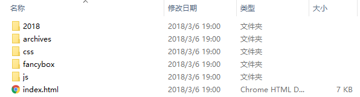
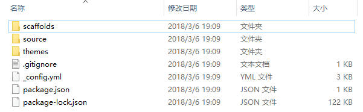
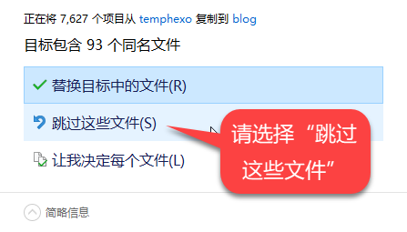

你有没有，经历过个人电脑的硬件故障，所有辛苦撰写或整理的资料烟消云散，捧着一块变成砖头的硬盘欲哭无泪？
你想不想，把你撰写或整理的资料上传到网上，以便可以随时随地进行访问和阅读，并分享给与你有或类似需要的人？

如果答案是肯定的，那么，你应该搭建一个专属的博客站点。

本文基于 Windows 10 x64 操作系统，主要描述如何利用 Hexo 及 GitHub 和 / 或码云来搭建你的专属博客站点。本文涉及的工具软件及网络服务大致如下：

* **[Hexo](https://hexo.io/zh-cn/)**：是一个快速、简洁且高效的静态博客框架，可使用 Markdown 格式来编写博文，能够自动生成静态 html 文件，并一键部署到远程仓库。Hexo 的运行需要 Node.js。
  * **[Node.js](https://nodejs.org/)**：是一个基于 Chrome V8 引擎构建的 JavaScript 运行时，让 JavaScript 可以在非浏览器环境下运行。若将 Node.js 视为一个解释器，则 Hexo 就是一个通过这个解释器而运行的应用。
* **[Git](https://git-scm.com/)**：是一个广泛应用的、先进的分布式版本管理工具软件。
  * **[GitHub.com](https://github.com/)**：是全球最大的代码托管网站，也是本文博客站点的远程部署位置之一。使用 Git 可以与 GitHub 进行交互，并实现代码仓库的版本管理。
  * **[Gitee.com](https://gitee.com/)**：中文名为码云，是类似于 GitHub 的国内代码托管仓库，可免费建立私有项目，同时也提供了项目管理等更多的功能。

> ** 为什么选择 Hexo**：目前开源社区存在大量的博客框架，如 WordPress、Jekyll 等，规模不一架构迥异，根据各人知识背景及需求，可能会有不同的偏好和选择。本文选用 Hexo，主要基于轻便、免费及无需后台服务器等方面的考虑。

本文的主要内容有：安装相关软件、建立本地博客站点、部署到远程仓库，以及在多个设备间实现博客站点的同步等。

## 安装相关软件

Hexo 的安装和运行，以及后续博客站点的远程部署和管理，要求在系统中安装好 Git 和 Node.js。

### 安装 Git 和 Node.js

从 [Git](https://git-scm.com/download/) 和 [Node.js](https://nodejs.org/en/download/) 官方网站下载适用本机平台的安装程序，目前 Git 的版本为 2.16.2、Node.js 的版本为 8.9.4。

双击运行刚下载的安装程序，并按屏幕提示完成安装。安装时采用默认选项即可，但要特别注意启用了与环境变量（PATH）相关的选项。

安装完成后，从开始菜单中选择 “Git | Git Bash”（也可使用 Windows 的命令提示符，但推荐使用 GitHub Bash），输入如下命令，若正确显示 Git 和 Node.js 版本，则表明安装成功：

```bash
$ git version
git version 2.16.2.windows.1

$ node -v
v8.9.4
```

### 安装 Hexo

继续在 Git Bash 中输入如下命令，并耐心等待相关依赖包的下载，当屏幕上显示如下提示且返回提示符 `$` 时，即表示 Hexo 已安装完成：

```bash
$ npm install -g hexo-cli
...

+ hexo-cli@1.1.0
added 103 packages in 25.033s
```

> ** 提示 **：`npm` 是随同 Node.js 一起安装的 JavaScript 的包管理器，用于从 NPM 服务器上下载第三方包（例如本文主角 Hexo 等）到本地使用。若国外 NPM 服务器连接不便或速度很慢，可通过如下命令来启用国内的淘宝 NPM 镜像：
> ```bash
> $ npm config set registry https://registry.npm.taobao.org
> ```

随后，使用下面的命令来查看刚刚安装的 Hexo 的版本：

```bash
$ hexo -v
hexo-cli: 1.1.0
os: Windows_NT 10.0.16299 win32 x64
...
```

至此，相关软件的安装全部完成。这个过程看似复杂，但实际操作起来非常简单：Git 和 Node.js 均有图形安装界面，基本上只需一直 “Next” 即可，而 Hexo 的安装也只是输入 `npm install -g hexo-cli` 一行命令而已。一切顺利的话，大约几分钟之内就能搞定。

现在，可以开始使用 Hexo 来构建你的专属博客站点了。

## 建立本地博客站点

打开资源管理器，并在你打算存放博客站点的位置（例如 `D:\`）中右击并选择 “Git Bash Here”，输入如下命令来让 Hexo 以指定的名称（例如 `blog`）创建一个文件夹，并将其初始化为 Hexo 博客站点：

```bash
$ hexo init blog
INFO  Cloning hexo-starter to D:\blog
Cloning into 'D:\blog'...
...

$ cd blog
$ npm install
...

up to date in 8.258s
```

返回命令提示符后，表明基本的博客站点已准备就绪。

在资源管理器中查看 `blog` 文件夹，可发现 Hexo 已自动生成了站点所需的大量内容（如下图）。关于这些文件夹和文件的说明，详见 [Hexo 的相关文档](https://hexo.io/zh-cn/docs/setup.html)。



> ** 提示 **：如果你计划将站点部署到 GitHub 上，则不妨将博客站点文件夹命名为 `<username>.github.io` 的形式（其中 `<username>` 是你在 GitHub 上的用户名，下同），以便在本地设备和网络服务间保持一致。

### 预览本地博客站点

启动 Hexo 本地服务器，看看运行中的博客站点是什么样子：

```bash
$ hexo server
INFO  Start processing
INFO  Hexo is running at http://localhost:4000/. Press Ctrl+C to stop.
```

打开浏览器，在地址栏中输入上面命令中提示的 <http://localhost:4000> 并回车。一切正常的情况下，就可以看到期待已久的博客站点了（如下图）。Hexo 非常贴心，默认时已经有一篇名为 “Hello World” 的文章，其内容主要是 Hexo 的文档链接，以及几个常用命令的简要说明。



> ** 提示 **：若浏览器无法显示上述地址，可能是 `4000` 端口已被占用。要解决这个问题，可按 “Ctrl+C” 关闭 Hexo 现有的服务器，然后尝试以其它端口重新启动服务器。
>  ```bash
>  $ hexo server -p 4001
>  INFO  Start processing
>  INFO  Hexo is running at http://localhost:4001/. Press Ctrl+C to stop.
>  ```

### 配置你的专属信息

博客站点已经可以正常运行，但美中不足的是它还不是你专属的博客：网站标题为 “Hexo”，作者为 “John Deo”。要定义你自己的专属信息，可打开站点配置文件（`blog/_config.yml`），根据下面的 `#` 注释结合你的实际情况，修改 `# Site` 的相关选项（必要时添加自定义的端口），然后保存文件：

```yml
# Site
title: ## 你的站点标题
subtitle: ## 你的站点副标题
description: ## 你的站点描述（关键字）
author: ## 你的名字（作者）
language: zh-CN ## 让界面按钮等以中文显示

# Server（如果确实需要指定非 4000 端口，可在最后增加这个配置）
server:
  port: 4001
```

> ** 提示 **：站点配置文件文件采用了 YAML 语言格式，对于内容格式有严格要求，输入时请注意正确缩进，并且在每个 `:` 之后保留一个空格。

在 Git Bash 中重新启动服务器，再刷新浏览器中的博客站点，可以看到博客站点已真正变成你的专属博客，并且部分界面元素也显示为中文了。

恭喜你！你的专属博客站点已经搭建完毕。现在你可以开始撰写你的博客文章了。

不过，目前的博客站点仍局限在本地，还无法让任何人随时随地通过互联网来访问和阅读。并且，我们还需要未雨绸缪，对博客站点的文章源码及相关配置进行备份，以便万一在本地系统出现故障后，我们仍然能够迅速而又完整地取回博客站点的原始数据。

为此，我们还需要再做一点努力。

## 博客站点的远程部署

实现博客站点的远程部署，显然你需要有一个远程仓库，用来存放已发布的文章，同时也用于备份所有博文的源码及整个博客站点的配置。

### 创建远程仓库

访问 [GitHub.com](https://github.com/) 并注册一个用户，通过邮件激活后登录，然后生成并上传你的 SSH 公钥。

在 GitHub 上创建名为 `<username>.github.io` 的仓库，注意其中的 `<username>` 是你在 GitHub 上的用户名，并且用户名之后还应该有 `.github.io`（不是 `.com`）。

进入该仓库的 “Settings” 页面，在 “Options | GitHub Pages” 部分可看到：`GitHub Pages is currently disabled. You must first add content to yourrepository before you can publish a GitHub site`。这表明，你必须把本地博客站点部署到这个远程仓库上，才能访问你的 GitHub Pages 主页。

> ** 提示 **：GitHub Pages 是你在 GitHub 上的用户 / 组织或项目的主页，每个 GitHub 用户 / 组织只能有一个用户 / 组织主页，但可以有数量不限的项目主页。GitHub Pages 基于相应的 GitHub 用户或仓库，只需把编辑后的内容推送到仓库，主页的内容即可自动更新。

### 部署前的准备

在使用 Hexo 把博客站点部署到 GitHub 之前，还必须先安装部署工具，并对要部署的内容及目标位置进行一些配置。

#### 安装部署工具

对应于 Git 的 Hexo 部署工具是 “hexo-deployer-git”。在 `blog` 文件夹中打开 Git Bash，并输入如下命令来安装这个部署工具（从输出结果中可以看到，当前 hexo-deployer-git 的版本为 0.31）：

```bash
$ npm install hexo-deployer-git --save
...

+ hexo-deployer-git@0.3.1
added 31 packages in 16.036s
```

#### 配置部署选项

再次打开此前修改站点专属信息的配置文件（`blog/_config.yml`），找到 `deploy` 部分，并输入如下配置：

```yml
deploy:
  - type: git
    repo:  git@github.com:<username>/<username>.github.io.git
    branch: master
  - type: git
    repo:  git@github.com:<username>/<username>.github.io.git
    branch: src
    extend_dirs: /
    ignore_hidden: false
    ignore_pattern:
      public: .
```

采用上述配置，Hexo 将在执行一键部署时，一次性把已发表的博客文章推送到远程仓库的 `master` 分支，同时把文章源码及站点相关设置推送到 `src` 分支：

> ** 提示 **：关于各部署选项的详细说明，请参阅 [hexo-deployer-git](https://github.com/hexojs/hexo-deployer-git) 在 GitHub 上的说明。

### 执行部署与备份

现在，终于可以进行一键部署了。在 `blog` 文件夹中打开 “Git Bash”，并运行如下命令。在一大堆输出的最后，出现了 `INFO Deploy done: git` 并返回提示符 `$`，表示部署完毕：

```bash
$ hexo deploy
...
INFO Deploy done: git
```

博客站点的远程部署已经完成，赶快拿起你的手机（正在使用的电脑也可以），打开浏览器，输入 `https://<username>.github.io` 并进入。不出意料的话，你应该可以看到此前在本地服务器上看到的 “Hello World” 页面。

在 GitHub 上打开你的 `<username>.github.io` 仓库。进入 `master` 分支，可看到已发布的博客文章；进入 `src` 分支，可看到存放博文源码的 `source` 文件夹，刚刚修改过的 `_config.yml`，以及 `themes`、`.gitignore` 等等与站点配置相关的文件夹和文件等。由此，你可以确认，本地站点的所有有效内容，都已推送至远程仓库。

从此，你只需在每次新建或修改文章、或者是改变站点的配置之后，简单地执行一次部署，就可确信就算末日来临，你的专属博客的一切都不会丢失。甚至，如果你比我还懒的话，部署时可以输入简化的 `hexo d -g` 命令。

### 把博客部署到码云

什么？你觉得 GitHub 速度太慢，并且有时候可能被墙导致无法访问？或许，你应该试试国内的代码托管网站 [码云](https://gitee.com/)。

码云也提供了类似的 Pages 服务，托管你的博客的套路与也 GitHub 差不多：同样需要注册激活登录，上传 SSH 公钥，然后创建 `<username>` 项目（** 注意 **：与 GitHub 不同的是，不需要也不可以有 `gitee.io` 后缀）；进入项目页面选择 “服务 | Pages”, 再选择 “master” 分支并单击 “启动服务”。这样，码云的远程仓库就准备好了。

接着，把站点配置文件 `deploy` 部分的 `repo` 修改为包含 `github` 和 `gitee` 两个子节点，并在子节点的定义中指定远程仓库的地址及目标分支。这样，你就可以一次性地把你的博客站点同时部署到 GitHub 和码云上了。

```yml
deploy:
  - type: git
    repo:
      github: git@github.com:<username>/<username>.github.io.git,master
      gitee: git@gitee.com:<username>/<username>.git,master
  - type: git
    repo:
      github: git@github.com:<username>/<username>.github.io.git,src
      gitee: git@gitee.com:<username>/<username>.git,src
    extend_dirs: /
    ignore_hidden: false
    ignore_pattern:
      public: .
```

> ** 警告 **：`repo` 子节点的仓库地址和分支之间只有一个逗号（`,`），不能有空格。否则将出现 `fatal: remote part of refspec is not a valid name in HEAD: master` 错误，并且部署中断。

在浏览器中访问 `<username>.gitee.io`（没错，这里需要 `gitee.io`），就可以访问你部署在码云上的博客了。

## 多设备同步

把博客站点部署到远程仓库后，你发表的博客文章已经可以随处阅读了。但是，你还想在公司在家里在路上在洗手间…… 在浴缸里撰写并发表博客，又该怎么办？

### 克隆远程仓库

这好办！找另一台电脑，没有的话，在本机上找一个临时文件夹也行。在希望存放本地博客站点的位置打开 “Git Bash”，然后输入如下命令来把远程仓库克隆到 `blog` 目录中：

```bash
$ git clone git@github.com:<username>/<username>.github.io.git blog
Cloning into '<username>.github.io'...

... done.
```

> ** 提示 **：若要从码云上克隆仓库，则使用 `git clone git@gitee.com:<username>/<username>.git blog` 命令。

在资源管理器中打开克隆到的 `blog` 文件夹，并查看其内容：



怎么回事？这个克隆仓库中，居然只有已发表的博客文章。说好的源码呢？精心挑选的主题呢？复杂难解的站点配置都到哪去了？别担心，它们就在仓库里。你要做的，只是进入本地的克隆仓库，并切换到 `src` 分支：

```bash
$ cd blog
$ git checkout src
Switched to branch 'src'
Your branch is up to date with 'origin/src'.
```

再次查看 `blog` 文件夹的内容，谢天谢地，终于都回来了：



### 重新初始化本地站点

不过，先别高兴得太早。克隆下来的文件夹中，并不包含运行 Hexo 所需的 `node_modules` 文件夹及 `db.json` 文件。为此，可退回在 `blog` 的上级目录，并按前面 “建立本地博客站点” 所述的方式，初始化一个临时的博客站点：

```bash
cd ..
$ hexo init temp_hexo
INFO  Cloning hexo-starter to D:\temp\temphexo
...
$ cd temp_hexo
$ npm install
```

然后，在资源管理器中，拷贝 `temp_hexo` 文件夹中的全部文件，并粘贴到 `blog` 文件夹中（** 注意 **：必须先把 `blog` 切换到 `src` 分支）。当出现 “同名文件” 提示时，切记选择 “跳过这些文件”，以便保留来自远程仓库的站点最新内容及配置。



为稳妥起见，可参照前面 “测试本地博客站点” 的方式，启动 Hexo 服务器并在浏览器中检查博客的内容是否正确。再打开 `_config.yml` 并查看自定义的配置（例如前面的部署配置）是否仍然存在，而不是被覆盖为刚刚初始化的站点设置。

一切检查无误之后，你就可以在新设备上撰写和部署你的博客了。

## 尾声

折腾了这么久，你终于可以、也应该写一篇博客了吧？如果你一时半会儿想不出来要写什么，那么这个折腾过程本身就是一个不错的主题。如果你还是嫌麻烦，至少也应该写一篇最为短小精悍的博文，并在其中只包含一个指向本文的链接吧。

至于如何流畅快速地创建、撰写和管理博文，下次我们再来专门聊一聊。如果你已迫不及待，可以先看看官方文档的 “[写作](https://hexo.io/zh-cn/docs/writing.html)” 部分。

现在，如果你又修改了站点的内容，无论是修改了站点配置，还是撰写了新的博文，你都应该马上执行一次部署，以免意外丢失你的工作。然后，你就可以安心休息了……
