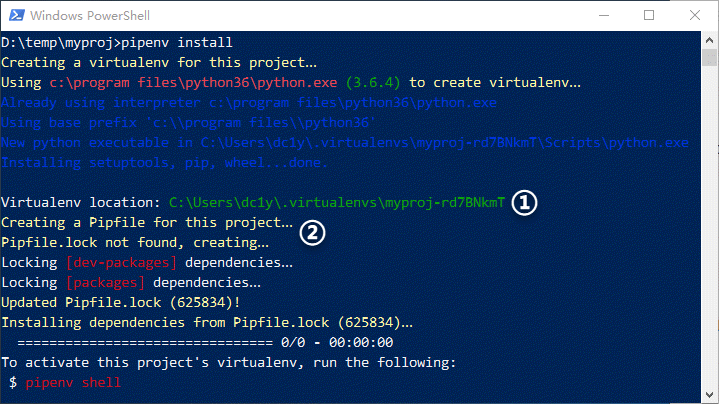
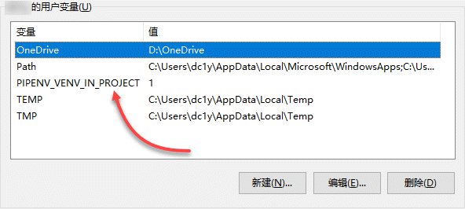

假设你已经 ，并受客户 A 委托开发一个网站项目，你为该项目创建了一个文件夹并开始编码，期间还安装了一些库，包括 Django 框架，其版本为 1.8.19。项目投产后反应良好，以至于客户 B 也委托你开发另一个网站，项目 B 同样需要 Django，且其最新版本为 2.3。但你不敢贸然在系统级上安装这个新版本，因为替换掉老版本后，原来的项目 A 可能会因潜在的不兼容问题而出错。这时候你有两个选择：要么继续使用旧版本，要么升级 Django 并确保项目 A 仍能正常运行。

可以肯定的是，这两种做法都无法令你满意。这时候，你就需要 **虚拟环境（Virtual Environment）** 了。
<!-- more -->

# 虚拟环境与包管理

如果你在开始项目之前，就分别为项目 A 和项目 B 创建了虚拟环境，那么，你可以自由地在项目 B 中安装 Django 2.3，而丝毫不必担心对项目 A 中现有的 Django 1.8.19 造成影响。

除上述的版本不兼容风险外，不同性质的 Python 项目可能需要安装和使用不同的第三方库，例如网站开发可能会使用 Django、Flask 等，而在进行数据分析时，又可能需要 numpy、pandas 等。如果把所有的第三方库都直接安装到系统级的 Python 环境中，势必会造成不必要的混乱和冗余。此外，若你的项目需要协作，在多个协作者之间重建完全一致的开发环境，也将面临极大的困难。更为严重的是，对于 Linux 等自带 Python 的系统来说，若其任务和操作所依赖的系统级 Python 环境被不慎破坏，甚至可能造成整个系统的崩溃。

解决上述问题的办法是，**始终为每一个项目创建一个虚拟环境**，并在其中只安装与项目直接相关的各种库及其依赖。每个虚拟环境就是一个独立的文件夹，可确保各项目的依赖彼此隔离，不会相互影响，同时也避免了对系统级的 Python 环境造成污染或破坏。

多年来，Python 社区在虚拟环境及包管理方面开发和积累了大量工具，如 easy_install、pip、virtualenv、virtualenvwrapper、virtualenv-burrito、autoenv、pyenv、pyvenv 等等，甚至 Python 3 还加入了一个名为 venv 的标准库。在这些工具中，最经典且广泛使用的是 pip 和 virtualenv，前者用于管理第三方包，而后者用于管理虚拟环境。

如果你对这些工具及其名称感到眼花缭乱，无所适从，别担心…… 创建于 2017 年 1 月的 pipenv 结束了 Python 虚拟环境及包管理方面的混乱局面。

# pipenv 入门

目前，[pipenv](https://github.com/pypa/Pipenv) 已成为 Python 官方推荐的包管理工具。它整合了 pip 和 virtualenv 的功能，旨在成为 Python 项目最好的依赖管理器。Pipenv 能够为你的项目自动创建和管理虚拟环境，并在你安装 / 卸载包时，在 Pipfile 中添加 / 移除相关的条目。它甚至能够生成更重要的 Pipfile.lock，从而精确再现开发环境。

与前面提到的其它虚拟环境和包管理工具相比，pipenv 更简明、更人性化。

## 安装 pipenv

作为创建每个项目不可或缺的依赖管理器，Pipenv 几乎是安装 Python 之后的第一个必装工具。不过，为避免 pipenv 及其依赖包破坏系统级上的 Python 环境，最好在用户级上安装 pipenv。

以你的 Windows 帐户登录系统，运行如下命令来确认系统中已安装了 pip，然后使用 `--user` 参数来在用户级上安装 pipenv：

```shell
C:\Users\username>pip --version
pip 9.0.1 from c:\program files\python36\lib\site-packages (python 3.6)
C:\Users\username>pip install --user pipenv
```

安装完成后，尝试运行如下命令查看 pipenv 的版本号：

```shell
C:\Users\username>pipenv --version
'pipenv' 不是内部或外部命令，也不是可运行的程序或批处理文件。
```

刚刚安装的 pipenv 居然无法使用？原来，执行用户级安装时，pipenv 将被安装到 C:\Users\username\AppData\Roaming\Python\Python36\Scripts 中。要想能够直接运行 pipenv，必须将这个路径添加到用户的环境变量中。

> **提示**：运行如下命令，可查看用户级的包路径，将最后的 `site-packages` 替换为 `Scripps`，就是用户级可执行文件（包括 pipenv）的安装位置：
  ```shell
  C:\Users\username>py -m site --user-site
  C:\Users\username\AppData\Roaming\Python\Python36\site-packages
  ```

进入 “控制面板 | 用户帐户 | 用户帐户”，单击左侧的 “更改我的环境变量”（如下图），打开当前用户的“环境变量” 对话框，在上方的用户变量列表中选择 Path 并单击 “编辑...”，添加 `C:\Users\username\AppData\Roaming\Python\Python36\Scripts` 后，依次点击各对话框的“确定” 来确认修改：


> **提示**：在开始菜单中搜索 “环境变量”，并单击找到的 “编辑帐户的环境变量”，可以快速打开当前用户的 “环境变量” 对话框。

重新启动命令提示符，再次查看 pipenv 的版本，可发现刚刚设置的用户环境变量已经生效：

```shell
C:\Users\username>pipenv --version
pipenv, version 11.8.3
```

## pipenv 的基本操作

使用传统的 pip 和 virtualenv，项目的虚拟环境及包管理通常涉及若干步骤：创建虚拟环境、激活虚拟环境、安装项目所需的包、禁用虚拟环境等等。并且，在项目开发过程中，还需要时不时手工维护 requirements.txt。整个过程相当繁琐，除非始终保持警惕和耐心，否则非常容易出错。

相比之下，pipenv 的虚拟环境及包管理则非常简单，大大缓解了虚拟环境及包管理的脑力消耗。

### 初始化项目

创建并进入名为 `myproj` 的项目文件夹，运行 `pipenv install` 即可初始化项目环境（如下图）：

> ** 提示 **：在 Windows 10 中，要在指定路径快速打开 “命令提示符”，可在资源管理器中打开该路径，Shift + 右击任意空白位置，并从弹出的菜单中选择 “在此处打开 PowerShell 窗口”，然后在 PowerShell 中运行 `cmd` 命令。



初始化项目时，pipenv 在当前用户目录的 `.virtualenvs` 中创建了一个虚拟环境（上图①），并在项目文件夹中生成 Pipfile 文件和 Pipfile.lock 文件（上图②），然后锁定项目依赖并更新 Pipfile.lock，再按该文件的内容安装依赖——当然，目前项目的依赖数量为 0。

从命令输出中可以看到，虚拟环境中包含系统级 python.exe 的副本，并且也安装了 setuptools、pip、wheel 等工具，构成了一个完整的、独立于系统级的 Python 运行环境。运行如下命令，可查看项目虚拟环境的路径，并确认当前采用的 python.exe 来自于这个虚拟环境：

```shell
D:\temp\myproj>pipenv --venv
C:\Users\dc1y\.virtualenvs\myproj-rd7BNkmT
D:\temp\myproj>pipenv --py
C:\Users\dc1y\.virtualenvs\myproj-rd7BNkmT\Scripts\python.exe
```

Pipfile 及相应的 Pipfile.lock 文件用于跟踪管理项目的依赖信息，可取代并且优于传统的 requirements.txt。Pipfile 定义了项目的具体要求，包括从何处获取依赖包，对直接依赖包进行分组等内容。项目环境的细节则存储在 Pipfile.lock 中，包括所有的第三方包及其递归依赖包的确定版本号及其它信息，可用于精确再现项目环境。Pipfile.lock 通过 `pipenv lock` 命令自动生成，不必也不可手工创建和修改。

由于项目当前没有任何依赖，因此 Pipfile 和 Pipfile.lock 文件中只有一些骨架代码。

> **提示**：Pipfile 和 Pipfile.lock 均应纳入到项目的版本管理中。

### 安装项目依赖包

安装依赖包的命令与初始化项目的命令是一样的，只不过加上了要安装的包而已。实际上，你可以跳过初始化项目阶段，直接采用如下命令来在一个步骤中初始化项目、同时安装指定的包：

```shell
D:\temp\myproj>pipenv install requests
Installing requests…
...

Adding requests to Pipfile's [packages]…
Pipfile.lock (48ca4e) out of date, updating to (18fa8f)…
Locking [dev-packages] dependencies…
Locking [packages] dependencies…
Updated Pipfile.lock (18fa8f)!
Installing dependencies from Pipfile.lock (18fa8f)…
  ================================ 8/8 - 00:00:03
To activate this project's virtualenv, run the following:
 $ pipenv shell
 ```

无需专门激活虚拟环境，只需一个命令即可安装指定的包，同时更新 Pipfile 和 Pipfile.lock 文件。默认时，pipenv 将安装指定包的当前版本，若需指定具体版本，可包名后面加上版本号，例如：`pipenv install requests=='2.18.4'`。

除项目产品所需的包外，项目开发环境中通常还会用到其它包，如单元测试的 pytest、nose 等，但产品环境并不需要它们。为区分这种类型的包，可在运行安装命令时加入 `--dev` 选项：

```shell
D:\temp\myproj>pipenv install --dev pytest
Installing pytest…
Collecting pytest
  Downloading pytest-3.5.0-py2.py3-none-any.whl (194kB)
...
Successfully installed attrs-17.4.0 colorama-0.3.9 more-itertools-4.1.0 pluggy-0.6.0 py-1.5.3 pytest-3.5.0

Adding pytest to Pipfile's [dev-packages]…
Pipfile.lock (85daf0) out of date, updating to (48ca4e)…
Locking [dev-packages] dependencies…
Locking [packages] dependencies…
Updated Pipfile.lock (48ca4e)!
Installing dependencies from Pipfile.lock (48ca4e)…
  ================================ 10/10 - 00:00:04
To activate this project's virtualenv, run the following:
 $ pipenv shell
```

从命令输出中可以看到，pytest 及其依赖已被安装到项目环境中。同时，在 Pipfile 文件的 [dev-packages] 部分添加了 pytest，并更新了 Pipfile.lock 文件的 `"develop"` 部分。

### 使用已安装的包

现在，编写一个简单的 main.py，在其中导入并使用刚刚安装的 requests：

```python
import requests

response = requests.get('https://httpbin.org/ip')
print('Your IP is {0}'.format(response.json()['origin']))
```

然后，使用 `pipenv run` 命令来运行这个脚本，该命令将自动激活虚拟环境：

```shell
D:\temp\myproj>pipenv run python main.py
Your IP is 8.8.8.8
```

你也可以先激活虚拟环境，再直接使用 `python` 来运行脚本（`exit` 可退出虚拟环境）：

```shell
D:\temp\myproj>pipenv shell
Launching subshell in virtual environment. Type 'exit' to return.
Microsoft Windows [版本 10.0.16299.309]
(c) 2017 Microsoft Corporation。保留所有权利。

D:\temp\myproj>python main.py
Your IP is 8.8.8.8
D:\temp\myproj>exit
D:\temp\myproj>
```

## pipenv 的其它操作

如果希望把虚拟环境放在项目文件夹内，可在当前用户的 “环境变量” 对话框中，增加一个名为 PIPENV_VENV_IN_PROJECT 的用户变量，并将其值设置为 1（如下图）。



重启 “命令提示符” 后，运行如下命令，先移除用户目录中的现有虚拟环境，再在项目的. venv 目录中重建项目虚拟环境：

```shell
D:\temp\myproj> pipenv --rm
Removing virtualenv (C:\Users\username\.virtualenvs\myproj-rd7BNkmT)…
D:\temp\myproj>pipenv install
Creating a virtualenv for this project…
...

Virtualenv location: D:\temp\myproj\.venv
Installing dependencies from Pipfile.lock (7b8df8)…
  ================================ 5/5 - 00:00:04
To activate this project's virtualenv, run the following:
 $ pipenv shell
```

> ** 提示 **：如果需要重建项目开发环境，则加上 `--dev` 选项，即 `pipenv install --dev`。

此外，卸载不再需要的包可使用 `pipenv uninstall` 命令，更新包可使用 `pipenv update` 命令，显示依赖图可使用 `pipenv graph` 命令，等等。更多的命令和选项，请参阅 [pipenv 官方文档](https://docs.pipenv.org/)。

# 尾声

pipenv 确实简化了 Python 项目的虚拟环境和包管理。掌握了 pipenv，或许可在今后的项目节省你的时间，并减轻你的痛苦。
