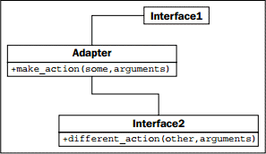

> **提示**：本文译自《Python 3 Object-oriented Programming, Second Edition》，Chapter 11: Python Design Patterns II。

与我们在第 8 章了解到的大多数模式不同，适配器模式用于与现有的代码交互。我们不会设计一组全新的、实现了适配器模式的对象。适配器用于让两个预先存在的对象一起工作，即使它们的接口并不兼容。与可让 VGA 投影仪插入到 HDMI 端口的显示适配器一样，适配器对象居于两个不同接口之间，并在它们之间进行实时转换。适配器对象的唯一目的就是执行这些转换。适配时可能涉及许多任务，如转换参数格式、重新安排参数次序、调用命名不同的方法，或者是提供默认参数等。

在结构方面，适配器模式类似于简化的装饰器模式。装饰器一般提供它们所替换的同名接口，而适配器则在两个接口间进行映射。下面是 UML 图：


<!-- more -->

在这里，**Interface1** 想要调用 **make_action(some, arguments)**。我们已经有 **Interface2** 类可完成所需的任务（为避免重复，我们不想重新编写这个类），但它提供的方法却是 **different_action(other, arguments)**。**Adapter** 类实现了 **make_action** 接口，并将其参数映射到现有的接口。

这种方式的优点是，把一个接口映射到另一个接口的代码全部在一个位置。其它的方案可能相当丑陋；我们不得不在每个需要访问这些代码的地方，在多个位置执行转换。

例如，假定我们已有了如下的类，它接受 “YYYY-MM-DD” 格式的字符串日期，并计算某个人在指定日期的年龄：

```python
class AgeCalculator:
    def __init__(self, birthday):
        self.year, self.month, self.day = (
                int(x) for x in birthday.split('-'))

    def calculate_age(self, date):
        year, month, day = (
                int(x) for x in birthday.split('-'))
        age = year - self.year
        if (month, day) < (self.month, self.day):
            age -= 1
        return age
```

这是一个相当简单的类，它完成了应该完成的任务。但我们对这个程序员的考虑感到惊讶，他使用了特殊格式的字符串、而不是 Python 的极其有用的内置 `datetime` 库。作为一个尽可能重用代码的尽责的程序员，我们编写的大多数程序都将与 `datetime` 对象交互，而不是字符串。

我们有几种选择来解决这种情况；可以把类重写为接受 `datetime` 对象，这样至少会更加精确。但若这个类来自于第三方，并且我们不知道或不能改变其内部结构，就只能尝试其它方式了。我们可以按原样使用这个类，并在每次需要根据 `datetime.date` 对象计算年龄时，调用 `datetime.date.strftime('%Y-%m-%d')` 来将其转换为适当的格式。但这种转换可能发生在许多地方，更糟的是，若把 `%m` 误输为 `%M`，则将返回当前的分钟数而不是月份！想像一下你在许多地方都写错了，则改正时也非常麻烦。这不是可维护的代码，也违背了 DRY 原则。

相反，我们可编写一个适配器，以便可把普通的日期插入到 `AgeCalculator` 类中：

```python
import datetime

class DateAgeAdapter:
    def _str_date(self, date):
        return date.strftime("%Y-%m-%d")

    def __init__(self, birthday):
        birthday = self._str_date(birthday)
        self.calculator = AgeCalculator(birthday)

    def get_age(self, date):
        date = self._str_date(date)
        return self.calculator.calculate_age(date)
```

这个适配器把 `datetime.date` 和 `datetime.time`（均有同样的 `strftime` 接口）转换为可供 `AgeCalculator` 使用的字符串。现在我们就可以通过新的接口来使用原来的代码了。我把方法签名定为 `get_age`，以演示发起调用的接口也可以寻找不同的方法名，而不仅仅是采用不同类型的参数。

以这种方式创建一个适配器类，是实现适配器模式的常规方式，但，Python 照例有其它方式来做这个事情。继承和多重继承可用于向类添加功能。例如，我们可以在 `date` 类上添加一个适配器，以便它可以与原来的 `AgeCalculator` 类一起工作：

```python
import datetime

class AgeableDate(datetime.date):
    def split(self, char):
        return self.year, self.month, self.day
```

这样的代码令人怀疑其在 Python 中是否合法。我们在子类中添加了一个 `split` 方法，接受一个参数（但未使用，只为满足`split`方法的要求）并返回年、月和日的元组。这个类完全可以与原来的 `AgeCalculator` 一起工作，因为后者的代码对一个特殊格式的字符串调用了 `split`（原文为 `strip`，疑误），并返回一个包含年月日的元组。`AgeCalculator` 的代码只关注 `split` 是否存在且返回适当的值；它不关心我们是否真的传入了字符串。这个类确实可以正常工作：

```python
>>> bd = AgeableDate(1975, 6, 14)
>>> today = AgeableDate.today()
>>> today
AgeableDate(2015, 8, 4)
>>> a = AgeCalculator(bd)
>>> a.calculate_age(today)
40
```

虽然可以工作但却是愚蠢的做法。在这个特定的例子中，这个适配器很难维护。我们很快就会忘记为什么要给 `date` 类添加一个 `split` 方法。这个方法的名称含义模糊。这可能是适配器的通病，但显式创建一个适配器、而不是使用继承，通常可澄清其用途。

除继承外，有时也可以使用猴子补丁来向现有的类添加一个方法。这种方式不适合于 `datetime` 对象，因为它不允许在运行时添加属性，但在普通的类中，我们可以添加一个新方法，并提供发起调用的代码所需的适配接口。或者，也可以扩展 `AgeCalculator` 本身或对其应用猴子补丁，用更适合我们需要的方法来替换掉 `calculate_age` 方法。

最后，通常还可以使用函数来充当适配器；这似乎与适配器模式的实际设计不太吻合，但若记得函数实质上只是带有 `__call__` 方法的对象，则函数就会成为一种明显的适配器。
