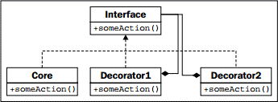

> **提示**：本文译自《Python 3 Object-oriented Programming, Second Edition》，Chapter 10: Python Design Patterns I。

装饰器模式允许我们把提供核心功能的对象，“包裹”在改变这个功能的其它对象中。任何对象与这个经过装饰的对象交互时，可采用完全相同的方式，就像该对象并未经过装饰时一样（即，经过装饰的对象，具有与核心对象完全相同的接口）。

装饰器模式有两种主要用途：

* 改进某个组件向另一个组件发送数据时的响应
* 支持多种可选行为

第二种用途通常是多重继承的合理替代方案。我们可以构建一个核心对象，然后围绕它创建装饰器。由于装饰器对象具有与核心对象相同的接口，我们甚至还可以把它再包裹到另一个装饰器中。下面是装饰器的UML图：


<!-- more -->

图中，Core及全部装饰器都实现了Interface。装饰器通过组合的方式，维护着一个指向Interface实例的引用。当被调用时，装饰器在调用它所包裹接口的之前或之后，执行额外的操作。被包裹的对象可以是另一个装饰器，也可以是核心功能。尽管多个装饰器可以彼此包裹，但处于所有装饰器“中心”的对象提供了核心功能。

# 装饰器示例

让我们来看看一个使用TCP socket进行网络编程的例子。`socket.send()`接收一串输入字节，并将其输出到接收端的socket。有许多库采用了socket，并调用这个函数来发送数据流。让我们创建这样一个交互式shell，它等待来自客户端的连接，然后提示用户输入一个字符串作为响应：

```python
import socket

def respond(client):
    response = input("Enter a value: ")
    client.send(bytes(response, 'utf=8'))
    client.close()

server = socket.socket(socket.AF_INET, socket.SOCK_STREAM)
server.bind(('localhost', 2401))
server.listen(1)
try:
    while True:
        client, addr = server.accept()
        respond(client)
finally:
    server.close()
```

`respond`函数接受一个socket参数，并提示用户输入作为应答的数据，然后发送该数据。为使用这个函数，我们构建了一个服务器socket，并让其监听本地计算机的2401端口（可随意选择）。当某个客户端建立了连接时，将调用`respond`函数，该函数在交互式地请求应答数据后，作出相应的响应。需要注意的重点是，`respond`函数只关注socket接口的两个方法：`send`和`close`。要测试这个对象，可编写一个简单的客户端，来连接到同一个端口，并在输出来自服务器的响应后退出：

```python
import socket

client = socket.socket(socket.AF_INET, socket.SOCK_STREAM)
client.connect(('localhost, 2401))
print("Received: {0}".format(client.recv(1024)))
client.close()
```

使用这两个程序的步骤如下：

1. 在一个终端中启动服务器。
2. 打开另一个终端窗口，并运行客户端。
3. 在服务器窗口的 **Enter a value:** 提示中，键入一个值并回车。
4. 客户端将接收到你键入的内容，将其打印在控制台后退出。再一次运行客户端；服务器将再一次提示输入响应值。

现在再看看服务器代码，这些代码有两个部分。`respond`函数把数据发送给一个socket对象。其余的脚本则负责创建这个socket对象。我们将创建两个装饰器，来自定义socket的行为，而不必扩展或修改socket本身。

让我们先从“logging”装饰器开始。这个对象将把要发送的数据先输出到服务器控制台，然后再发送给客户端：

```python
class LogSocket:
    def __init__(self, socket):
        self.socket = socket

    def send(self, data):
        print("Sending {0} to {1}".format(data, self.socket.getpeername()[0]))
        self.socket.send(data)

    def close(self):
        self.socket.close()
```

这个类装饰了一个socket对象，并向客户端socket提供了`send`和`close`接口。更完整的装饰器，应该同时实现（并且可能自定义）其余的socket方法。同时也应正确地实现`send`的所有参数（实际上该方法接受一个可选的标志参数），但是，我们想让示例保持简单！每次调用该对象的`send`方法时，它将把输出记录到屏幕，然后再使用原来的socket向客户端发送数据。

要使用这个装饰器，我们只需修改一行代码。把调用`respond`时传入的socket，改为传入经过装饰的socket：

```python
respond(LogSocket(client))
```

尽管非常简单，但我们为何不扩展socket类并重写`send`方法呢？我们可以在进行日志记录后，再调用`super().send`来执行实际的发送。这个设计也没错。

当面对装饰器和继承的选择时，若需根据某些条件动态地修改对象，则只能选择装饰器。例如，我们可能只想在服务器处于调试模式时，才启用日志装饰器。当有多于一种的可选行为时，装饰器也优胜于多重继承。作为示例，我们可编写另一个装饰器，以便在调用`send`时使用`gzip`来压缩数据：

```python
import gzip
from io import BytesIO

class GzipSocket:
    def __init__(self, socket):
        self.socket = socket

    def send(self, data):
        buf = BytesIO()
        zipfile = gzip.GzipFile(fileobj=buf, mode="w")
        zipfile.write(data)
        zipfile.close()
        self.socket.send(buf.getvalue())

    def close(self):
        self.socket.close()
```

这个版本的`send`方法在把数据发送给客户端之前，先对数据进行压缩。

现在我们有了两个装饰器，我们可以编写代码，以便在响应时动态地切换装饰器。下面的示例并不完整，但演示了混搭装饰器应遵循的逻辑：

```python
client, addr = server.accept()
if log_send:
    client = LoggingSocket(client)
if client.getpeername()[0] in compress_hosts:
    client = GzipSocket(client)
respond(client)
```

这段代码检查一个假想的、名为`log_send`的配置变量。若该变量启用，则把socket包裹在LoggingSocket中。同样，代码检查已连接的客户端是否存在于可接受压缩内容的地址列表中。若是，则把client再进一步包裹到GzipSocket装饰器中。注意根据配置和已连接客户端的情况，这两个装饰器可能全不或全部启用、或者是只启用其中一个。尝试用多重继承来编写这个例子，并看看结果有多乱！

# Python中的装饰器

装饰器模式在Python中很有用，但有其它做法。例如，我们可以使用猴子补丁（monkey-patching）来得到类似的效果，见第7章的相关讨论。单重继承也是一种选择，其中“可选”的计算在一个较大的方法中执行；而多重继承，也不能仅仅只为不适合于刚才的例子而完全否决。

在Python中，在函数上应用这种模式相当常用。我们在前一章了解到，函数也是对象。实际上，函数的装饰是如此常见，以至于Python提供了一种特殊的语法，来方便对函数应用装饰器。

例如，我们可以用更普遍的观点来观察日志的示例。除在调用socket的发送时记录日志外，记录对某些函数或方法的所有调用的日志可能也很有用。下面的示例实现了执行这个功能的装饰器：

```python
import time

def log_calls(func):
    def wrapper(*args, **kwargs):
        now = time.time()
        print("Calling {0} with {1} and {2}".format(func.__name__, args, kwargs))
        return_value = func(*args, **kwargs)
        print("Executed {0} in {1}ms".format(func.__name__, time.time() - now))
        return return_value
    return wrapper

    def test1(a, b, c):
        print("\ttest1 called")

    def test2(a, b):
        print("\ttest2 called")

    def test3(a, b):
        print("\ttest3 called")
        time.sleep(1)

    test1 = log_calls(test1)
    test2 = log_calls(test2)
    test3 = log_calls(test3)

    test1(1, 2, 3)
    test2(4, b=5)
    test3(6, 7)
```

这个装饰器函数非常类似于我们前面探索的示例；在前面的例子中，装饰器接受一个类socket对象，并创建另一个类socket对象。在这里，我们的装饰器接受一个函数对象，并返回一个新的函数对象。这段代码由三个独立的任务组成：

* 一个`log_calls`函数，它接受另一个函数
* 这个函数（在内部）定义了一个名为`wrapper`的新函数，`wrapper`在调用传入的函数之前（及之后）执行了一些额外的操作
* 返回这个新函数

三个`test*`函数演示了装饰器的用法。`test3`包含了`sleep`调用来演示定时测试。我们把每一个函数传入到装饰器中，这个装饰器返回一个新函数。我们把这个新函数赋值给原来的变量名，实际上是用装饰过的函数替换掉了原来的函数。

这种语法允许我们动态地建立经过装饰的函数对象，与装饰socket的示例一样；如果不替换变量名，我们甚至可以保留装饰过和未装饰的版本，以便在不同的情况下使用。

这些装饰器所带来的修改，通常永久性地应用到各个函数上。在这种情况下，Python支持用一种特殊的语法，来在定义函数时应用装饰器。我们已在讨论`property`装饰器时看到这种语法；现在，让我们看看它的工作方式。

与在定义方法之后再应用装饰器函数不同，我们可以使用`@decorator`语法来一次性完成装饰：

```python
@log_calls
def test1(a, b, c):
    print("\ttest1 called")
```

这种语法的首要优点时，是我们可以在函数定义的同时，就看到它被装饰了。若在后面再应用装饰器，阅读代码的人，可能会没看到函数已被完全改变了。回答诸如这样的问题，“为什么我的程序日志函数调用了控制台？”，可能会变得非常困难！不过，这种语法只能应用到我们定义的函数，因为我们无法访问其它模块的源代码。如果需要装饰第三方库的函数，则必须使用前面的语法。

除刚才看到的语法之外，还有更多的装饰器语法。在这里，我们没有足够的篇幅来探讨这个高级主题，因此，请查阅Python参考手册或其它教程，以获得更多信息。装饰器也可创建可调用对象，而不仅仅是返回函数的函数。类也可以被装饰；此时，装饰器返回一个新类，而不是一个新函数。最后，装饰器可以接受参数，并在逐个函数的基础上进行定制。
