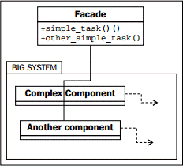

> **提示**：本文译自《Python 3 Object-oriented Programming, Second Edition》，Chapter 11: Python Design Patterns II。

外观模式旨在为一个复杂的组件系统提供一个简单的接口。对于复杂的任务，我们可能必须跟这些对象直接交互，但这样的系统通常有一些 “典型” 用法，并不需要复杂的交互。外观模式允许我们定义一个新对象，用来封装系统的典型用法。每次需要访问常用功能时，可使用这个对象的简化接口。若项目的其它部分需要访问更为复杂的功能，仍然可以直接与系统交互。外观模式的 UML 图完全依赖于子系统，但大致如下：



外观对象在许多方面类似于适配器。主要区别是外观试图从复杂的接口中抽象出一个简化接口，而适配器只是尝试把一个现有的接口映射到另一个。

让我们来为一个 email 应用编写一个简单的外观。如我们在第 7 章所见，在 Python 中发送 email 的底层库相当复杂。而两个接收消息的库甚至更糟。

要是有一个简单的类就好了，它可让我们发送邮件，并列出 IMAP 或 POP3 连接上的当前收件箱中的邮件。为保持示例简短，我们采用了 IMAP 和 SMTP：这是两个处理 email 的完全不同的子系统。我们的外观只执行两个任务：发送一封邮件到指定地址，以及检查 IMAP 连接上的收件箱。它做了一些常见的假设，例如 SMTP 和 IMAP 的主机为同一地址，两者的用户名和密码相同，并且都使用了标准端口。这个外观覆盖了许多邮件服务器的场景，但若某个程序员需要更灵活的方式，仍可绕过外观并直接访问这两个子系统。

外观类使用了邮件服务器的主机名、登录用的用户名和密码来初始化：

```python
import smtplib
import imaplib

class EmailFacade:
    def __init__(self, host, username, password):
        self.host = host
        self.username = username
        self.password = password
```

`send_email` 方法格式化邮件地址和消息，并使用 `smtplib` 进行发送。这个任务并不复杂，但需要把传入外观的 “自然” 参数进行一些处理，以便以正确的格式提供给 `smtplib` 进行发送：

```python
    def send_email(self, to_email, subject, message):
        if not "@" in self.username:
            from_email = "{0}@{1}".format(self.username, self.host)
        else:
            from_email = self.username
        message = ("From: {0}\r\n"
                "To: {1}\r\n"
                "Subject: {2}\r\n\r\n{3}").format(
                    from_email,
                    to_email,
                    subject,
                    message)
        smtp = smtplib.SMTP(self.host)
        smtp.login(self.username, self.password)
        smtp.sendmail(from_email, [to_email], message)
```

方法开头的 `if` 语句，用于检查 `username` 是完整的发件人邮箱地址，还是只有 `@` 左边部分；不同的主机的登录细节会有区别。

最后，获取当前收件箱中的消息的代码相当混乱；IMAP 协议过度设计了，而 `imaplib` 标准库只是该协议的一层薄封装：

```python
def get_inbox(self):
    mailbox = imaplib.IMAP4(self.host)
    mailbox.login(bytes(self.username, 'utf8'),
        bytes(self.password, 'utf8'))
    mailbox.select()
    x, data = mailbox.search(None, 'ALL')
    messages = []
    for num in data[0].split():
        x, message = mailbox.fetch(num, '(RFC822)')
        messages.append(message[0][1])
    return messages
```

现在，把这些代码放在一起，我们就有了一个简单的外观类，可用相当直观的方式来发送和接收消息，比与这些复杂的库直接交互要简单得多。

尽管在 Python 社区中很少提及，但外观模式是 Python 生态不可或缺的一部分。因为 Python 强调语言的可读性，语言本身及其库倾向于为复杂的任务提供易于理解的接口。例如，`for` 循环、`list` 推导及生成器等，都是较为复杂的迭代器协议的外观。`defaultdict` 的实现是一个外观，它剥离了字典中不存在某个键的边际条件。第三方的 requests 库是一个强大的外观，封装了可读性较差的 HTTP 请求库。
