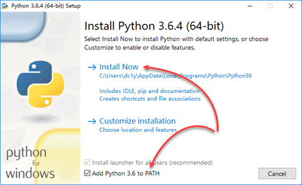
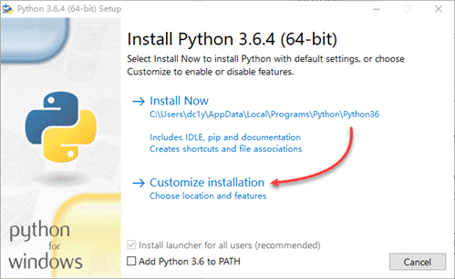
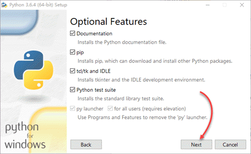
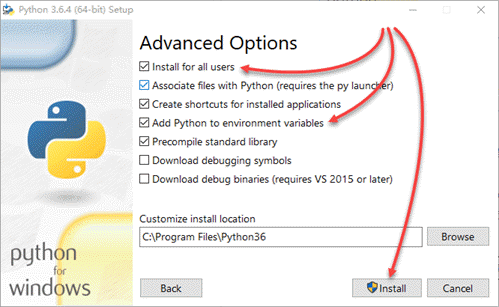

> **提示**：Python 核心团队已计划在 2020 年 1 月 1 日正式停止支持 Python 2，除非确实需要，否则应尽早安装并迁移到 Python 3。

在 Windows 中，Python 的安装似乎非常简单，按大多数教程的说法，只需从 [Python.org](https://www.python.org/) 下载适合你的操作系统的安装程序，然后运行这个安装程序，在安装界面上启用 Add Python 3.6 to PATH，再单击 Install Now，即可完成安装：



不过，这种 “简单” 的安装方式，实质上是在用户级别上安装 Python，最终的安装位置位于当前用户目录下（如 C:\Users\\<username\>\AppData\Local\Programs\Python\Python36\），其结果是只有当前用户能够使用 Python。一旦你以其它用户登录 Windows，运行 python 命令将出现如下错误提示：

```none
'python' 不是内部或外部命令，也不是可运行的程序或批处理文件。
```

<!-- more -->

要在系统级上安装可供所有 Windows 帐户使用的 Python，必须采用自定义的安装方式。下面是在 Windows 10 64-bit 平台上安装系统级 Python 的步骤：

1. 以管理员帐户登录 Windows，运行 Python 安装程序，并选择 Customize installation：
    

2. 保持 Optional Feature 的默认选择，并单击 Next：
    

3. 在 Advanced Options 中，启用 Install for all users 及 Add Python to environment variables，然后单击 Install 开始安装：
    

4. 安装完成后，在管理员和非管理员用户中，运行 “命令提示符” ，并输入如下命令查看刚刚安装的 Python 的版本号。一切顺利的话，你就可以在多个 Windows 用户中使用 Python 了：
    ```none
    C:\Users\<username>python --version
    Python 3.6.4
    ```

> **提示**：如果你打算执行全新的安装，则应在卸载 Python 后，再删除原来的安装目录及其中可能遗留的包。

安装好 Python 后，在开始任何项目之前，你还必须全面了解 Python 的虚拟环境和包管理的概念，并掌握相关工具的使用，详见《pipenv，人性化的 Python 开发流程》。
