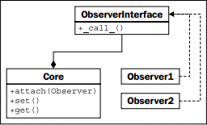

> **提示**：本文译自《Python 3 Object-oriented Programming, Second Edition》，Chapter 10: Python Design Patterns I。

观察者模式对于状态监测及事件处理等情况非常有用。这种模式允许一个对象被一组未知的、动态的 “观察者” 对象监测。

当核心对象的一个值发生改变时，它将通过调用 `update()` 方法来通知所有观察者对象变化已经发生。每个观察者则负责在核心对象变化时执行不同的任务；核心对象并不知道、也不关心这些任务是什么，而观察者通常也不知道或关心其它观察者在做什么。

下面是观察者模式的 UML 图：


<!-- more -->

# 观察者的示例

观察者模式在冗余备份系统中非常有用。我们可以编写一个核心对象来维护某些值，然后让一个或多个观察者创建该对象的序列化拷贝。这些拷贝可能存储在数据库、远程主机或本地文件中。让我们使用属性来实现这个核心对象：

```python
class Inventory:
    def __init__(self):
        self.observers = []
        self._product = None
        self._quantity = 0

    def attach(self, observer):
        self.observers.append(observer)

    @property
    def product(self):
        return self._product
    @product.setter
    def product(self, value):
        self._product = value
        self._update_observers()

    @property
    def quantity(self):
        return self._quantity
    @quantity.setter
    def quantity(self, value):
        self._quantity = value
        self._update_observers()

    def _update_observers(self):
        for observer in self.observers:
            observer()
```

这个对象有两个属性，当设置属性值时，将调用其自身的 `_update_observers` 方法。该方法所做的，就是遍历可用的观察者、并让每个观察者得知有些东西改变了。在这个例子中，我们直接调用了观察者对象；观察者对象必须实现 `__call__` 来处理更新。这在许多面向对象的编程语言中是行不通的，但在 Python 中，这是增强代码可读性的有用捷径。

现在，让我们实现一个简单的观察者对象；该对象仅仅是把一些状态打印到控制台上：

```python
class ConsoleObserver:
    def __init__(self, inventory):
        self.inventory = inventory

    def __call__(self):
        print(self.inventory.product)
        print(self.inventory.quantity)
```

这里没啥特别让人惊喜的；被观察的对象在初始化器中传入，随后调用了观察者，做了 “一些事情”。我们可在交互式控制台中测试这个观察者：

```python
>>> i = Inventory()
>>> c = ConsoleObserver(i)
>>> i.attach(c)
>>> i.product = "Widget"
Widget
0
>>> i.quantity = 5
Widget
5
```

把观察者附加（`attach`）到存货对象后，每次我们改变两个被观察的属性中的任何一个时，观察者就会被调用，并且其动作得以执行。甚至，我们还可以添加两个不同的观察者实例：

```python
>>> i = Inventory()
>>> c1 = ConsoleObserver(i)
>>> c2 = ConsoleObserver(i)
>>> i.attach(c1)
>>> i.attach(c2)
>>> i.product = "Gadget"
Gadget
0
Gadget
0
```

现在，当我们改变产品时，出现两组输出，每个观察者一组。这里的关键在于，我们可以轻易添加完全不同类型的观察者，用于把数据同时备份到文件、数据库或 Internet 应用中。

观察者模式把被观察的代码，从执行观察的代码中分离出来。如果不使用这种模式，则我们将不得不把代码放入到每个属性中，以便处理各种可能的情况；在控制台显示日志、更新数据库或文件，等等。这些任务各自的代码，将全部混杂到被观察的对象中。维持这样的对象将是一场噩梦，并且日后添加新的监测功能也将极其痛苦。
