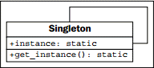

> **提示**：本文译自《Python 3 Object-oriented Programming, Second Edition》，Chapter 10: Python Design Patterns I。

单例模式是最有争议的模式；许多人指其为一种 “反模式”，即应避免采用和发扬的模式。在 Python 中，若有人使用了单例模式，则几乎肯定是犯了错，因为他们来自于某种限制较严的编程语言。

那还有什么讨论的必要呢？单例是最出名的设计模式之一。它在极度面向对象的语言中很有用，也是传统面向对象编程的关键部件。更贴切地说，单例背后的概念很有用，即使我们在 Python 中以完全不同的方式来实现这个概念。

单例模式背后的基本概念，是让某个对象只能有唯一的实例存在。一般来说，这个对象是某种类似于我们在第 5 章讨论的管理器类。这种对象通常需要被大范围的其它对象引用，并把管理器对象的引用传递给各种需要它的方法和构造器，这样可能让代码变得难于阅读。

相反，若使用了单例，则各对象从单例类中请求管理器对象的单一实例，因此无需将其引用四处传递。下面的 UML 图未能完全描述这个过程，但在此提供以确保完整性：


<!-- more -->

在大多数编程环境中，单例被强制为其构造器是私有的（因此不能再创建额外的实例），然后提供一个静态方法来获取这个单一的实例。这个方法在首次被调用时创建一个新实例，并在后续的每一次调用中返回这个实例。

# 单例的实现

Python 没有私有的构造器，但针对这种情况有更好的做法。我们可以使用 `__new__` 类方法来确保只能创建一个实例：

```python
class OneOnly:
    _singleton = None
    def __new__(cls, *args, **kwargs):
        if not cls._singleton:
            cls._singleton = super(OneOnly, cls).__new__(cls, *args, **kwargs)
        return cls._singleton
```

当 `__new__` 被调用时，通常会构建相应类的一个实例。我们重写了这个方法，首先检查单例实例是否已经创建；若未创建，则通过 `super` 调用进行创建。这样，每当我们调用 `OneOnly` 的构造器时，总是得到完全相同的实例：

```python
>>> o1 = OneOnly()
>>> o2 = OneOnly()
>>> o1 == o2
True
>>> o1
<__main__.OneOnly object at 0xb71c008c>
>>> o2
<__main__.OneOnly object at 0xb71c008c>
```

这两个对象是相等的，且位于相同的地址；因此它们是同一个对象。这种特殊的实现不是很透明，因为没有明显表示创建了一个单例对象。当我们调用构造器时，通常期待生成对象的一个新实例；这种做法违背了这个契约。若确实需要单例的话，详尽的文档字符串或可缓解这个问题。

但我们不需要这种做法。Python 人不会强制代码的用户进入特定的思维模式。我们可能觉得永远只需要一个类实例，但其他程序员可能有别的观点。例如，单例可能会妨碍分布式计算、并行编程和自动测试。在这些情况中，有某个特定对象的多个或替代实例可能很有用，即使 “正常” 的操作并不需要更多的实例。

模块变量可模拟单例。

在 Python 中，通常可用模块级的变量来模拟单例模式。这不如单例那么 “安全”，因为可随时对这些变量进行重新赋值，但这与我们在第 2 章讨论的私有变量一样，在 Python 中是可以接受的。若有人有充足的理由改变这些变量，为什么要阻止他们？模块变量也不能阻止人们实例化该对象的多个实例，但还是一样，若有人有充足的理由这么做，何必去阻止他们？

理想情况下，我们应向他们提供一种机制来获取 “默认的单例” 值，同时也允许他们在需要时创建其它实例。尽管技术上完全不是单例，但却为类单例行为提供了最 Python 式的机制。

要使用模块级变量来代替单例，可在定义一个类之后创建它的一个实例。我们可以把状态模式改进为使用单例。取代在每次改变状态时创建一个新对象，我们可以创建一个始终可以访问的模块级变量：

```python
class FirstTag:
    def process(self, remaining_string, parser):
        i_start_tag = remaining_string.find('<')
        i_end_tag = remaining_string.find('>')
        tag_name = remaining_string[i_start_tag+1:i_end_tag]
        root = Node(tag_name)
        parser.root = parser.current_node = root
        parser.state = child_node
        return remaining_string[i_end_tag+1:]

class ChildNode:
    def process(self, remaining_string, parser):
        ...

class OpenTag:
    def process(self, remaining_string, parser):
        ...

class TextNode:
    def process(self, remaining_string, parser):
        ...

class CloseTag:
    def process(self, remaining_string, parser):
        ...

first_tag = FirstTag()
child_node = ChildNode()
text_node = TextNode()
open_tag = OpenTag()
close_tag = CloseTag()
```

我们所做的，就是创建各种状态类的可供重用的实例。注意我们在类中访问了这些模块变量，即使这些变量尚未定义。这是因为类中的代码在方法被调用前不会执行，而到了调用时，整个模块也都已定义完成了。

本例的区别是，取代浪费内存创建一堆需要进行垃圾回收的新实例，我们重用了每种状态的单一状态对象。即使同时运行多个解析器，也只需要使用这些状态类。

当初在创建基于状态的解析器时，你可能奇怪我们为何不把解析器对象传递给各个状态的 `__init__`，而是将其传递给 `process` 方法。将解析器传递给各状态，就可通过 `self.parser` 来引用它。这对于状态模式的实现来说没有问题，但可能导致无法利用单例模式。若状态对象维护着一个对解析器的引用，则将无法用于同时引用其它解析器。

> 记住，这是两种不同用途的不同模式；单例模式对于实现状态模式很有用，并不意味着这两种模式是相关的。
