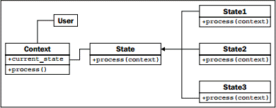
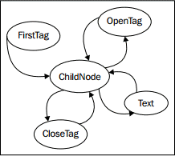

> ** 提示 **：本文译自《Python 3 Object-oriented Programming, Second Edition》，Chapter 10: Python Design Patterns I。

状态模式在结构上类似于策略模式，但其意图和目的则区别很大。状态模式的目标是表达一个状态迁移系统：对象可明显处于某种特定状态，且某些动作可将其推向另一状态的系统。

在状态模式中，我们需要一个管理器，或者是上下文类来提供一个切换状态的接口。在内部，这个类包含一个指向当前状态的指针；每个状态都知道可以进入其余的哪些状态，并根据所发生的动作来迁移到这些状态。

因此，我们需要两种类，上下文类及多个状态类。上下文类维护当前的状态，并把动作委托给状态类。相对于调用上下文的对象来说，状态类一般是隐藏的；就像一个在内部执行状态管理的黑匣子。下面是状态模式的 UML 图：


<!-- more -->

# 状态示例

为演示状态模式，让我们来建立一个 XML 解析工具。上下文类就是解析器本身。它将接受一个字符串作为输入，并把这个工具置于初始的解析状态。每一种状态都将 “吃掉” 一些字符，寻找某个特定值，并在找到这个值时，改变到其它状态。其目标是为每个标记及其内容创建一个节点对象树。为保持简单，我们将只解析 XML 标记及标记名的一个子集。这个工具将不处理标记上的属性。它将解析标记的文本内容，但不会试图解析在文本内包含标记的 “混合” 内容。下面是这个工具能够解析的一个 “简化版 XML” 文件的例子：

```xml
<book>
    <author>Dusty Phillips</author>
    <publisher>Packt Publishing</publisher>
    <title>Python 3 Object Oriented Programming</title>
    <content>
        <chapter>
            <number>1</number>
            <title>Object Oriented Design</title>
        </chapter>
        <chapter>
            <number>2</number>
            <title>Objects In Python</title>
        </chapter>
    </content>
</book>
```

在着眼于状态和解析器之前，让我们考虑一下这个程序的输出。我们知道需要一个 `Node` 对象，但这个 `Node` 应该是怎么样的？嗯，显然它需要知道它所解析的标记的名称，并且由于它是一个树状结构，因此或许也应维护一个指向父节点的指针，以及一个有序的子节点清单。有些但并非所有节点都有文本值。让我们先来看看 `Node` 类：

```python
class Node:
    def __init__(self, tag_name, parent=None):
        self.parent = parent
        self.tag_name = tag_name
        self.children = []
        self.text = ""

    def __str__(self):
        if self.text:
            return self.tag_name + ":" + self.text
        else:
            return self.tag_name
```

这个类在初始化时设置了默认的属性值。提供了 `__str__` 方法来在解析完成时可视化其树状结构。

现在，按照示例的说明，我们需要考虑解析器具备哪些状态。显然它应该从一个还没有处理任何节点的状态开始。我们还需要处理起始标记和结束标记的状态。当我们处于带文本标记的内部时，也必须有一个单独的状态来执行处理。

切换状态可能比较麻烦；我们怎么才能知道下一个节点是起始标记、结束标记，还是文本节点？我们可以在每种状态中加入一点逻辑来解决这个问题，但实际上更好的做法，是创建一个新的状态，其唯一的功能就是确定接着要切换到哪个状态。若将这个状态称为 **ChildNode**，则最终可得到如下状态：

* **FirstTag**
* **ChildNode**
* **OpenTag**
* **CloseTag**
* **Text**

**FirstTag** 状态将切换到 **ChildNode**，后者负责决定切换到其余三种状态的哪一种；当那些状态完成处理后，就切换回到 **ChildNode**。下面的状态迁移图显示了可用的状态变化：



这些状态将接受 “剩余未处理的字符串”，尽可能多地处理它们能够解析的内容，然后告诉解析器继续处理余下的内容。让我们先来建立 `Parser` 类：

```python
class Parser
    def __init__(self, parse_string):
        self.parse_string = parse_string
        self.root = None
        self.current_node = None
        self.state = FirstTag()

    def process(self, remaining_string):
        remaining = self.state.process(remaining_string, self)
        # 上面的 state.process 在解析完成后，把 parser 切换到另一个状态，
        # 故下面的递归调用，将会执行新的 state.process 方法
        if remaining:
            self.process(remaining)

    def start(self):
        self.process(self.parse_string)
```

初始化器在类中建立了几个供各状态访问的变量。`parse_string` 实例变量是我们将要解析的文本。`root` 节点是 XML 结构中的 “顶级” 节点。`current_node` 实例变量是当前向其添加子级的节点。

这个解析器的重要特征是其 `process` 方法，它接受剩余的字符串，并将其传递给当前状态。解析器本身（`self` 参数）也被传递给状态的 `process` 方法，以便状态能够访问并修改其变量。状态在完成处理后，必须返回剩余未解析的字符串。随后解析器递归地对剩余字符串调用 `process` 方法，以便建立余下的树状结构。

现在，让我们看看 `FirstTag` 状态：

```python
class FirstTag:
    def process(self, remaining_string, parser):
        i_start_tag = remaining_string.find('<')
        i_end_tag = remaining_string.find('>')
        tag_name = remaining_string[i_start_tag+1 : i_end_tag]
        root = Node(tag_name)
        parser.root = parser.current_node = root
        parser.state = ChildNode()
        return remaining_string[i_end_tag+1:]
```

这个状态找到第一个标记的开始和结束尖括号的索引号（`i_` 表示 index）。你可能觉得这个状态是不必要的，因为 XML 要求在起始标记之前不应有文本。但是，此处却可能有空白字符需要忽略；这就是我们搜索开始尖括号、而不是假定它是文档中的第一个字符的原因。注意这段代码假定了文件是有效的输入。正式的实现应严格测试无效的输入，并尝试恢复或显示详尽的错误消息。

这个方法提取标记的名称，并将其赋值给解析器的根节点。同时也赋值给 `current_node`，因为它也是接下来要添加子级的节点。

然后就是实现的部分：方法把解析器的当前状态改变到 `ChildNode` 状态。随后返回剩余的字符串（从开始标记之后开始）以作进一步处理。

`ChildNode` 状态看似复杂，实际上只是一组条件语句：

```python
class ChildNode:
    def process(self, remaining_string, parser):
        stripped = remaining_string.strip()
        if stripped.startswith("</"):
            parser.state = CloseTag()
        elif stripped.startswith("<"):
            parser.state = OpenTag()
        else:
            parser.state = TextNode()
        return stripped
```

`strip()` 调用从字符串中移除空白字符。随后确定解析器的下一个状态是起始或结束标记，还是文本字符串。根据条件语句的结果，把解析器设定到某个特定状态，然后让它解析剩余的字符串。

`OpenTag` 状态类似于 `FirstTag` 状态，不同的是，它把新创建的节点添加到 `current_node` 对象的 `children`，并将其设定为新的 `current_node`。在继续之前，还把解析器再次设定为 `ChildNode` 状态：

```python
class OpenTag:
    def process(self, remaining_string, parser):
        i_start_tag = remaining_string.find('<')
        i_end_tag = remaining_string.find('>')
        tag_name = remaining_string[i_start_tag+1 : i_end_tag]
        node = Node(tag_name, parser.current_node)
        parser.current_node.children.append(node)
        parser.current_node = node
        parser.state = ChildNode()
        return remaining_string[i_end_tag+1:]
```

`CloseTag` 状态的做法基本相反；它把解析器的 `current_node` 设置回父节点，以便外围标记的后续子级可添加到这个父节点：

```python
class CloseTag:
    def process(self, remaining_string, parser):
        i_start_tag = remaining_string.find('<')
        i_end_tag = remaining_string.find('>')
        assert remaining_string[i_start_tag+1] == "/"
        tag_name = remaining_string[i_start_tag+2 : i_end_tag]
        assert tag_name == parser.current_node.tag_name
        parser.current_node = parser.current_node.parent
        parser.state = ChildNode()
        return remaining_string[i_end_tag+1:].strip()
```

两个 `assert` 语句用于确认解析字符串的一致性。方法末尾的 `if` 语句（代码似乎有误）确保处理完成后终止程序。若节点的父级为 `None`，则意味着我们正在处理根节点。

最后，`TextNode` 只是简单地提取下一个结束标记之前的文本，并将其设置为当前节点的值：

```python
class TextNode:
    def process(self, remaining_string, parser):
        i_start_tag = remaining_string.find('<')
        text = remaining_string[:i_start_tag]
        parser.current_node.text = text
        parser.state = ChildNode()
        return remaining_string[i_start_tag:]
```

现在，必须设置解析器对象的初始状态设置。初始状态是一个 `FirstTag` 对象，因此只需将下面语句添加到 `__init__` 方法中：

```python
self.state = FirstTag()
```

要测试这个类，可添加一个主脚本来从命令行打开一个文件，执行解析，并打印生成的节点：

```python
if __name__ =="__main__":
    import sys
    with open(sys.argv[1]) as file:
        contents = file.read()
        p = Parser(contents)
        p.start()

        nodes = [p.root]
        while nodes:
            node = nodes.pop(0)
            print(node)
            nodes = node.children + nodes
```

这段代码打开指定的文件，加载其内容，并解析出结果。然后依次打印每个节点及其子级。节点类的 `__str__` 方法负责格式化节点以便打印。若对前面的 XML 例子运行这个脚本，其输出如下：

```shell
book
author: Dusty Phillips
publisher: Packt Publishing
title: Python 3 Object Oriented Programming
content
chapter
number: 1
title: Object Oriented Design
chapter
number: 2
title: Objects In Python
```

与原始的简化版 XML 的内容相对比，可发现解析器的确可以工作。

# 状态与策略的对比

状态模式看起来与策略模式非常相似；的确，它们的 UML 图是相同的。它们的实现也是相同的；我们甚至可以使用第一级函数来充当状态，而不是把它们包裹在对象中，就像在策略模式中那样。

尽管这两种模式有相同的结构，但它们解决的是完全不同的问题。策略模式用于在运行时选择一种算法；一般来说，只能从算法中选择其中之一来处理特定的用例。而状态模式的主旨，在于随着某个过程的进展，而动态地在不同状态间切换。在代码中，主要区别是策略模式通常并不知道其它策略对象。但在状态模式中，状态及上下文都需要知道它们可以切换到其余的哪一个状态。

# 状态迁移作为协同程序

状态模式是针对状态迁移问题的标准面向对象解决方案。然而，这个模式的代码相当繁琐。你可以通过把对象构建为协同程序来得到类似的效果。还记得我们在第 9 章建立的正则表达式日志文件解析器吗？这就是一个隐晦的状态迁移问题，其实现与定义状态模式所需的全部对象（或函数）的主要区别，在于协同程序解决方案可让我们把更多的样板代码编写在语言结构中。这是两种实现，没有哪一种天生优于另一种，但你可能会发现协同程序的可读性更好，相对于某种特定的 “可读性” 来说（你必须能够理解协同程序的语法）。
