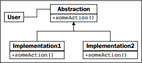

> ** 提示 **：本文译自《Python 3 Object-oriented Programming, Second Edition》，Chapter 10: Python Design Patterns I。

在面向对象编程中，策略模式常用于作为抽象的演示。这种模式针对一个问题实现了不同的解决方案，每个解决方案都是一个不同的对象。客户端代码可在运行时，动态地选择最合适的实现。

一般情况下，不同的算法有不同的权衡；某个算法可能比另一个算法更快，但使用更多的内存，而第三个算法则可能最适合于多 CPU 或分布式系统。下面是策略模式的 UML 图：


<!-- more -->

连接到策略模式的 **User** 代码，只需知道它与 **Abstraction** 的接口交互。被选定的实际实现执行同样的任务，但采用了不同的方式；无论如何，接口都是相同的。

# 策略的示例

策略模式的标准示例是排序程序；多年来，人们发明了对一个对象集合进行排序的众多算法；快速排序，归并排序和堆排序都是快速的排序算法，具有不同的特性并各有所长，这取决于输入的大小和类型，如何输出以及系统的需求。

如果我们有需要对一个集合进行排序的客户端代码，可给其传递一个带有 `sort()` 方法的对象。这个对象可以是 `QuickSorter` 或 `MergeSorter` 对象，但不管哪一个结果都一样：排序好的列表。用于执行排序的策略被从调用代码中抽象出来，使其成为可替换的模块。

当然，在 Python 中我们通常只需调用 `sorted` 函数或 `list.sort` 方法，并相信其将以近乎最优的方式执行排序。因此，我们确实需要一个更合适的例子。

让我们来考虑一个桌面墙纸管理器。当一张图像被显示在桌面背景时，它可以按不同的方式去适应屏幕的尺寸。例如，若图像小于屏幕，则可在屏幕上平铺、居中或放大到适应屏幕。还有其它更复杂的策略可供使用，如缩放至最大高度或宽度，将其组合到一个纯色的、半透明的或渐变的背景颜色，或者是其它操作。我们打算今后再添加这些策略，现在还是先从基本的策略开始。

我们的策略对象接受两个输入：要显示的图像，以及包含屏幕宽度和高度的一个元组。这些策略均根据屏幕尺寸返回一个新的图像，并且这个图像被指定的策略修改为与屏幕相适应。本例需要你运行 `pip3 install pillow` 来安装 `pillow` 模块：

```python
from PIL import Image

class TiledStrategy:
    def make_background(self, img_file, desktop_size):
        in_img = Image.open(img_file)
        out_img = Image.new('RGB', desktop_size)
        num_tiles =[
            o // i + 1 for o, i in zip(out_img.size, in_img.size)
        ]
        for x in range(num_tiles[0]):
            for y in range(num_tiles[1]):
                out_img.paste(in_img, (
                    in_img.size[0] * x,
                    in_img.size[1] * y,
                    in_img.size[0] * (x+1),
                    in_img.size[1] * (y+1)
                ))
        return out_img

class CenteredStrategy:
    def make_background(self, img_file, desktop_size):
        in_img = Image.open(img_file)
        out_img = Image.new('RGB', desktop_size)
        left = (out_img.size[0] - in_img.size[0]) // 2
        top = (out_img.size[1] - in_img.size[1]) // 2
        out_img.paste(in_img, (
            left, top,
            left + in_img.size[0], top + in_img.size[1]
        ))
    return out_img

class ScaledStrategy:
    def make_background(self, img_file, desktop_size):
        in_img = Image.open(img_file)
        out_img = in_img.resize(desktop_size)
        return out_img
```

这里我们有三个策略，每个策略都使用了 PIL 来执行它们的任务。各个策略都有一个 `make_background` 方法，该方法接受一组相同的参数。一经选定，相应的策略即被调用，并创建正确调整了大小的桌面图像。`TiledStrategy` 按输入图像铺满屏幕宽度和高度所需的数量进行循环，并在每个位置重复拷贝输入图像。`CenteredStrategy` 计算需要在四个边界留出多大的空间来让图像居中。`ScaledStrategy` 把图像强制调整为输出尺寸（忽略纵横比）。

考虑一下在没有策略模式下，该如何实现在这些选项间的切换。我们必须把所有代码放入到一个巨大的方法中，并使用笨拙的 `if` 语句来选择所需的选项。每次加入新的策略，都会让这个方法更笨重。

# Python 中的策略

前述策略模式的标准实现，尽管在许多面向对象的库中很常见，但在 Python 编程中却很少见。

这些类的对象，除提供一个函数外无所作为。我们可以将这个函数命名为 `__call__`，轻松将其变成一个可直接调用的对象。由于没有其它数据与该对象关联，我们所要做的，只不过是创建一组顶级函数，并把它们作为策略传入即可。

设计模式哲学的反对者会因此说，“因为 Python 有第一级的函数，因此策略模式是不必要的”。的确，Python 的第一级函数允许我们以更直接的方式实现策略模式。但了解该模式的存在，仍然可以帮助我们为程序选择正确的设计，并使用可读性更强的语法来实现它。当我们需要让客户端代码或最终用户从同一接口的多个实现中进行选择时，就应使用策略模式或其顶级函数的实现。
