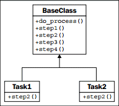

> **提示**：本文译自《Python 3 Object-oriented Programming, Second Edition》，Chapter 10: Python Design Patterns I。

模板模式对于移除重复代码很有用；它是一种支持第 5 章所讨论的 DRY（Don't Repeat Yourself）原则的实现。它是为几个要完成的任务有着一些共同步骤的情况而设计的。这些共同步骤在基类中实现，而不同的步骤则在子类中重写，以提供自定义的行为。在某种程度上，它类似于泛化的策略模式，但算法的相似部分使用一个基类来共享。下面是该模式的 UML 图：


<!-- more -->

# 模板的示例

让我们创建一个销售报告作为例子。我们可以把销售记录存储在一个 SQLite 数据库表中。SQLite 是一个基于文件的数据库引擎，允许我们使用 SQL 语法来存储记录。Python 3 在标准库中包含了 SQLite，因此不需要其它模块。

我们有两个共同的任务需要执行：

* 选择所有新车的销售，并以逗号分隔的格式输出到屏幕
* 以逗号分隔输出所有销售人员的列表，以及他们的销售总额，并保存为一个可导入到电子表格的文件

这看来像是区别很大的任务，但它们有一些共同的特征。在这两种情况下，我们需要执行如下步骤：

1. 连接到数据库。
2. 为新车或信息总额构建一个查询。
3. 执行查询。
4. 把结果格式化为以逗号分隔的字符串。
5. 把数据输出到文件或电邮。

这两个任务的查询构建和输出两个步骤是不同的，但其余步骤则完全相同。我们可以使用模板模式来把这些共同的步骤放在一个基类中，而有变化的步骤则放入两个子类。

开始之前，让我们用几行 SQL 来创建一个数据库，并存入一些示例数据：

```python
import sqlite3

conn = sqlite3.connect("sales.db")
conn.execute("CREATE TABLE Sales (salesperson text,"
        "amt currency, year integer, model text, new boolean)")
conn.execute("INSERT INTO Sales values"
        "('Tim', 9000, 2006,'Ford Focus','false'")
conn.execute("INSERT INTO Sales values"
        "('Gayle', 8000, 2004,'Dodge Neon','false')")
conn.execute("INSERT INTO Sales values"
        "('Gayle', 28000, 2009,'Ford Mustang','true')")
conn.execute("INSERT INTO Sales values"
        "('Gayle', 50000, 2010,'Lincoln Navigator','true')")
conn.execute("INSERT INTO Sales values"
        "('Don', 20000, 2008,'Toyota Prius','false')")
conn.commit()
conn.close()
```

即使不懂 SQL，可能你也能看出这里做了什么；我们创建了一个表来存储数据，并使用六个插入语句来添加销售记录。数据被存储在一个名为 `sales.db` 的文件中。现在我们就有了可在开发模板模式中使用的样本了。

由于我们已经概括了模板应该执行的步骤，我们可以从定义包含这些步骤的基类开始。每个步骤都有自己的方法（以便有选择地重写任一步骤），还有一个管理性的方法依次调用这些步骤。不带方法内容的代码大致如下：

```python
class QueryTemplate:
    def connect(self):
        pass

    def construct_query(self):
        pass

    def do_query(self):
        pass

    def format_results(self):
        pass

    def output_results(self):
        pass

    def process_format(self):
        self.connect()
        self.construct_query()
        self.do_query()
        self.format_results()
        self.output_results()
```

`process_format` 方法是被外部客户调用的主方法。它确保每个步骤按次序执行，但不关注步骤是在本类还是子类中实现的。对于本例，我们知道有三个方法在两个子类中是一样的：

```python
    def connect(self):
        self.conn = sqlite3.connect("sales.db")

    def construct_query(self):
        raise NotImplementedError()

    def do_query(self):
        results = self.conn.execute(self.query)
        self.results = results.fetchall()

    def format_results(self):
        output = []
        for row in self.results:
            row = [str(i) for i in row]
            output.append(",".join(row))
        self.formatted_results = "\n".join(output)

    def output_results(self):
        raise NotImplementedError()
```

为帮助子类的实现，两个未细化的方法抛出了 `NotImplementedError`。当抽象基类过于臃肿时，这是在 Python 中指定抽象接口的常用方式。方法也可以只有空实现（使用 `pass`），或者是完全没有定义。但抛出 `NotImplementedError` 有助于程序员理解这个类需要进行子类化并重写这些方法；空方法或不存在的方法很难被认出来需要实现，并且在未实现这些方法时需要调试。

现在我们有了模板类来处理繁琐的细节，但也可灵活执行和格式化各种各样的查询。最好的是，若我们需要把数据库引擎从 SQLite 改变为其它引擎（如 py-postgresql），我们只需修改模板类，而不必触及我们已经写好的两个（或两百个）子类。

现在让我们看看具体类：

```python
import datetime

class NewVehiclesQuery(QueryTemplate):
    def construct_query(self):
        self.query = "select * from Sales where new='true'"

    def output_results(self):
        print(self.format_results)

class UserGrossQuery(QueryTemplate):
    def construct_query(self):
        self.query = ("select salesperson, sum(amt)" +
                "from Sales group by salesperson")

    def output_results(self):
        filename = "gross_sales_{0}".format(
            datetime.date.today().strftime("%Y%m%d")
        )
        with open(filename, 'w') as outfile:
            outfile.write(self.formatted_results)
```

这两个类实际上非常短，考虑一下你做了什么：连接到数据库，执行查询，格式化结果并输出它们。超类负责了重复性的工作，但让我们轻松指定那些不同的步骤。此外，我们还可以轻易改变基类中的步骤。例如，如果想输出不是以逗号分隔的字符串（例如：要上传到网站的 HTML 报告），仍然可通过重写 `format_results` 来实现。
