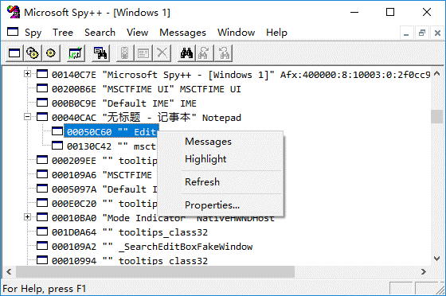

pywinauto 是一组 python 模块，可连接到指定 Windows 应用的进程，并通过向应用的窗口对话框和控件发送动作，来实现图形界面（GUI）的操作自动化。

在 pywinauto 出现之前，Python 社区中已存在若干 GUI 自动化工具，如 PyAutoGui、pyautoit、autopy 等。这些工具或基于图像识别或仅适用于较旧的 Win32 API，使用上的灵活性、准确度和效率上有一定的限制。相比之下，pywinauto 采用了面向对象的方式，并且只采用可读性较高的 Python 代码，不必另外再学习专用的脚本语言。

本文基于 Windows 10 x64 中文环境，内容涉及 pywinauto 的安装，同时也以记事本的自动化操作为例，揭示了 pywinauto 的基本功能和概念。
<!-- more -->

# 安装 pywinauto

为避免破坏系统级上的 Python 环境，我们将使用 pipenv 创建一个项目虚拟环境，并在这个项目环境中安装 pywinauto。打开 Windows 资源管理器，进入打算存放项目的位置（例如 D:\temp），在空白处右击并选择 “在此处打开 PowerShellp 窗口”，然后运行如下命令：

```shell
PS D:\temp> cmd
D:\temp>mkdir test_pywa
D:\temp>cd test_pywa
D:\temp\test_pywa>pipenv install pywinauto
Creating a Pipfile for this project…
Installing pywinauto…
...
To activate this project's virtualenv, run the following:
 $ pipenv shell
```

> **提示**：关于 Python 的虚拟环境和包管理，详见 。

耐心等待，直至 pipenv 在 test_pywa 文件夹中创建项目虚拟环境，并安装好 pywinauto。接着，让我们来快速测试一下 pywinauto：

```shell
D:\temp\test_pywa>pipenv run python
Python 3.6.4 (v3.6.4:d48eceb, Dec 19 2017, 06:54:40) [MSC v.1900 64 bit (AMD64)] on win32
Type "help", "copyright", "credits" or "license" for more information.
>>> from pywinauto.application import Application
>>> app = Application(backend="uia").start("notepad.exe")
>>> app.UntitledNotepad.type_keys("%FX")
...
pywinauto.findbestmatch.MatchError: Could not find 'UntitledNotepad' in 'dict_keys(['无标题 - 记事本 Dialog','Dialog','无标题 - 记事本'])'
```

出错了！不过，我们也发现了，当运行倒数第二行代码（即 `app = Application...`）时，记事本打开了，这起码说明 pywinauto 的确已经起作用了。错误信息显示 pywinauto 无法在 `dict_keys(['无标题 - 记事本 Dialog', 'Dialog', '无标题 - 记事本'])` 中找到 `UntitledNotepad`，或许我们可以试着运行：

```shell
>>> app['无标题 - 记事本'].type_keys("%FX")
<hwndwrapper.DialogWrapper - '', Notepad, 920150>
```

记事本退出了。代码中的 `type_keys` 表示按键，`%` 相当于 Alt，`type_keys("%FX")` 就是按下 “Alt+F,X”，从记事本菜单中可以看到，这个组合键对应于 “文件 | 退出”。这样，记事本退出也就不奇怪了。

> **提示**：也可以通过窗口类名来查找并退出记事本，即 `app.Notepad.type_keys("%FX")`。

现在，我们已安装了 pywinauto 且一切正常，可以更深入地了解 pywinauto 的更多功能了。

# 利用 pywinauto 进行自动化

通过上面这个简单的例子，你可能已经感觉到了，pywinauto 的自动化操作与我们平常的手工操作并无不同，只不过是通过代码来实现操作而已。操作过程通常都是先进入到应用中，找到要操作的窗口、对话框和控件，然后使用鼠标和键盘执行所需的操作。

下面，我们将再一次 pywinauto 启动记事本，并在交互式 python 中一步步执行一些操作，并在这个过程中了解涉及到的 pywinauto 概念和技术细节。

## 入口点——连接到应用的进程

照例运行 python，导入 pywinauto.application 模块，并创建该模块中的 Application 类的一个实例：

```shell
pipenv run python
>>> from pywinauto.application import Application
>>> app = Application(backend='win32').start('notepad.exe')
```

在上面的代码中，pywinauto 在一个新的进程中启动了记事本，并用一个名为 `app` 的 Application 实例连接到这个记事本进程。这个 `app` 实例就是自动化的入口点，后续的操作均以这个 app 为基础。

对于跨进程的应用来说，例如 Windows 10 的 “计算器” 就在一个以上的进程中绘制其界面部件，则应采用 Desktop 对象作为入口点：

```python
from subprocess import Popen
from pywinauto import Desktop

Popen('calc.exe', shell=True)
dlg = Desktop(backend="uia").Calculator
dlg.wait('visible')
```

### GUI 对象检查

上面的代码使用了 `backend` 来为 Application 实例指定后端的访问技术。Windows 有两种访问技术：

* Win32 API（`backend="win32"`）：默认的后端访问技术，适用于 MFC、VB6、简单的 WinForms 控件及大多数老旧的应用。
* MS UI Automation（`backend="uia"`）：适用于 WinForms、WPF、应用商店、Qt5、浏览器等。

> **提示**：pywinauto 不支持 Java AWT/Swing、GTK + 及 Tkinter 等。Linux 上的 AT SPI 及 Apple Accessibility API 未来有支持计划。

如果未能确认要采用的后端访问技术，可运行 Spy++ 或 Inspect.exe 并查看目标应用。若 Spy++ 能够显示应用的所有控件，则应采用 `"win32"` 后端，否则，在 Inspect.exe 中切换到 UIA 模式，若能够显示比 Spy++ 更多的控件和属性，则可选择 `"uia"`。

> **提示**：适用于 Windows 的 GUI 检查工具，可从 [这里](https://github.com/blackrosezy/gui-inspect-tool) 免费下载。

即使检查工具无法查看到应用的部分或全部控件，仍然可以利用基本的 mouse 和 keyboard 模块，通过生成鼠标和键盘事件来控制应用。

### 连接到目标应用的进程

创建 Application 实例后，必须将其连接到目标应用的进程。Application 提供了两个连接进程的实例方法：

```python
start(self, cmd_line, timeout=app_start_timeout)
connect(self, **kwargs)
```

start() 方法可启动目标应用，并连接到其进程，其中：`cmd_line` 是目标应用的路径及参数，如 `r"c:\path\to\your\application --arguments"`；`timeout` 参数可选，通常在应用启动时间非常长时使用。

connect() 方法则用于连接到已经启动的进程，可以向该方法传入应用的进程 ID（可在任务管理器中查看 PID）、应用的窗口句柄、可执行文件的路径，或者是各种窗口参数的任意组合。例如：

```python
# 传入 PID
app = Application().connect(process=2341)
# 传入句柄
app = Application().connect(handle=0x010f0c)
# 传入可执行文件路径
app = Application().connect(path=r"c:\windows\system32\notepad.exe")
# 参数组合，这些参数被传递给 pywinauto.findwindows.find_elements() 函数
app = Application().connect(title_re=".*Notepad", class_name="Notepad")
```

> **注意**：使用 connect() 方法时，通常需要编写一个循环来等待应用完全完成启动。

## 查找窗口、对话框和控件

连接到目标应用后，就可以透过这个 app 实例来访问记事本的窗口、对话框和控件了。首先运行以下语句，在记事本主窗口周围绘制绿色的轮廓线，以确认 app 实例连接到正确的应用：

```python
>>> app['无标题 - 记事本'].draw_outline()
```

上面的代码采用了字典索引的方式找到了记事本的主窗口，并执行了绘制轮廓线的方法。除此之外，你还可以使用 app.window() 方法来查找窗口，下面的语句同样可在记事本主窗口周围绘制轮廓线：

```python
app.window(title='无标题 - 记事本').draw_outline()
```

> **提示**：在英文操作系统上，你还可以采用魔法属性来查找窗口并绘制轮廓线，例如 `app.UntitledNotepad.draw_outline()`。不过，由于 Python 的属性不允许含有空格或其它特殊字符，因此在中文系统上无法采用这种方式，这也是本文最初的示例出错的原因。

为方便后续操作，让我们把记事本的主窗口保存到一个变量（例如 `mainwin`）中：

```python
>>> mainwin = app['无标题 - 记事本']
>>> mainwin
<pywinauto.application.WindowSpecification object at 0x000001AA025AD2E8>
```

记事本主窗口是一个 WindowSpecification 对象，它是 pywinauto API 的一个核心概念。WindowSpecification 对象并非真正的窗口或控件，而是一组描述窗口或控件的条件。执行操作时，pywinauto 会根据这些条件寻找匹配的窗口或控件。例如，目前 mainwin 的匹配条件就是窗口或控件应含有 `'无标题 - 记事本'` 字样，在当前情况下对应于记事本的主窗口。若 pywinauto 无法找到与这些条件相匹配的窗口或控件，就会抛出 ElementNotFoundError。

pywinauto 在查找窗口或控件时采用了最佳匹配（best match）的方式，这意味着你不必在 WindowSpecification 中指定绝对精确的条件。例如 `app['无题 - 记事本']`、`app['无题 - 记事']` 等等，都可以匹配目前情况下的记事本的主窗口。不过，为避免混淆，确定条件时还是应该尽量精确。

## 执行操作

掌握了查找窗口和控件的办法，就可以用代码来执行一些自动化操作了。运行如下语句：

```python
>>> mainwin.menu_select('帮助 -> 关于记事本')
```

上面的代码从 `mainwin` 的 “帮助” 菜单中选择了 “关于记事本”，打开了“关于记事本” 对话框。接着，让我们使用代码关闭这个对话框：

```python
>>> app['关于记事本']['确定'].click()
```

上面的代码中，首先通过 `['关于记事本']` 确定要操作的窗口，然后通过 `['确定']` 定位到 “确定” 按钮，最后调用 click()方法模拟鼠标单击这个按钮。

> **注意**：若上面代码未能关闭 “关于记事本” 对话框，可再重复运行一次。测试中发现，同样用代码来打开和关闭 “编辑 | 替换” 对话框，则不存在这个问题。若频繁出现这种现象，甚至需要数量不定的多次单击 “确定” 按钮，或许可考虑使用一个循环来解决问题，如下：

```python
while app['关于记事本'].visible
   app['关于记事本']['确定'].click()
```

### 查看控件标识符

现在，让我们在记事本主窗口的编辑框中输入一些内容，继续试验 pywinauto 的更多功能。第一步显然是定位到编辑框，但这个编辑框并没有标题，如何才能让 pywinauto 找到这个窗口呢？

一种办法是在 Spy++ 中找到并展开 “无标题 - 记事本”，右击其“Edit” 子项并选择 Highlight（如下图），可看到记事本的编辑窗口闪动数次，由此可确认 Edit 对应于记事本的编辑框。



另一种办法不需要依赖外部工具，调用 WindowSpecification 对象的 print_control_identifier() 方法，即可以树状列表的形式输出该对象所包含全部控件的标识符。例如查看记事本主窗口的所有控件：

```python
>>> mainwin.print_control_identifiers()
Control Identifiers:

Notepad - '无标题 - 记事本'    (L968, T148, R1798, B675)
['无标题 - 记事本 Notepad', '无标题 - 记事本', 'Notepad']
child_window(title="无标题 - 记事本", class_name="Notepad")
   |
   | Edit - ''    (L976, T199, R1790, B667)
   | ['无标题 - 记事本 Edit', 'Edit']
   | child_window(class_name="Edit")
   |
   | StatusBar - ''    (L976, T645, R1790, B667)
   | ['StatusBar', 'StatusBar   第 1 行，第 1 列', '无标题 - 记事本 StatusBar']
   | child_window(class_name="msctls_statusbar32")
```

可以看到主窗口包含编辑框和状态栏两个子窗口，同时也列出了访问这些子窗口的两种方式：字典索引和方法调用。其中的字典索引还列出了多个可选项，任选其一即可：

```python
>>> # 若采用不含非英文字符的字典索引，则可直接以属性的方式来访问，如下：
>>> mainwin.Edit.type_keys("自动化输入第一行", with_spaces = True)
>>> # 也可调用 child_window() 来得到编辑框
>>> mainwin.child_window(class_name="Edit").type_keys("{ENTER} 自动化输入第二行", with_spaces = True)
```

上面的代码调用了编辑框的 type_keys() 方法，向编辑框中输入指定的内容，其中 `with_spaces` 为 True，表示保留输入内容中的空格。

现在，我们已经完成了重要信息的输入，可以保存文件并关闭记事本，然后关闭 python 了：

```python
>>> mainwin.menu_select（'文件 -> 保存')
>>> app['另存为']['文件名 Edit'].set_text(r'D:\temp\test_pywa\pywa.txt')
>>> app['另存为']['保存 Button'].click()
>>> # mainwin.type_keys('%FX')      # 主窗口标题已经不是 “无标题 - 记事本” 了！
>>> app['pywa.txt - 记事本'].type_keys('%FX')
>>> quit()
```

上面的代码使用了 “标题 + 类名” 的方式来访问控件，可以最大限度减少歧义并避免访问到错误的控件。当然，若因此而导致控件索引过长，也可以适当精简，pywinauto 的 “最佳匹配” 大多数情况下都能够正确处理。

此外，代码中使用了 `set_text()` 方法来直接设置 “文件名” 编辑框的内容。这里也完全可以采用 `type_keys()` 方法，但这个方法对于禁用的编辑框是无效的，与手动操作时无法在禁用的编辑框中输入是一致的。

最后，在退出记事本时，注意此时标题已经从 “无标题 - 记事本” 变成了“pywa.txt - 记事本”，要引用记事本的主窗口，必须采用 `app['pywa.txt - 记事本']` 的形式。

> **提示**：“另存为” 对话框远比比记事本主窗口复杂，其中包含有地址栏、侧边栏目录树等等，调用 print_control_identifiers() 方法将输出大量内容，在其中寻找所需的控件非常困难。在这种情况下，使用前述的 Spy++ 及其 Highlight 功能，可以更容易地确定所需控件。

在资源管理器中，双击打开 pywa.txt 查看其内容，并确认一切符合预期。

## 完整的自动化代码

说来话长，但实际上整个导入模块、启动记事本、输入内容、保存后退出的有效代码总共只有约 10 行，如下：

```python
from pywinauto.application import Application

app = Application(backend='win32').start('notepad.exe')
mainwin = app['无标题 - 记事本']
mainwin.Edit.type_keys("自动化输入第一行", with_spaces = True)
mainwin.child_window(class_name="Edit").type_keys("{ENTER} 自动化输入第二行", with_spaces = True)
mainwin.menu_select（'文件 -> 保存')
app['另存为']['文件名 Edit'].set_text(r'D:\temp\test_pywa\pywa.txt')
app['另存为']['保存 Button'].click()
app['pywa.txt - 记事本'].type_keys('%FX')
```

将上述代码保存到 pywa.py 文件中，然后用 `pipenv run python pywa.py` 运行这个脚本。可以观察到记事本以极快的速度自动打开，输入内容后保存文件，最后退出。

# 其它自动化相关因素

GUI 构建通常需要执行大量的代码，并耗费一定的时间。也就是说，在执行 python 代码时，GUI 界面可能尚未完全生成并显示。pywinauto 有内置的默认超时，能够自动等待 GUI 的生成，而无须显式调用 sleep 或编写 while 循环。

如果有某些操作需要耗费大量时间，随后才能显示或关闭某个窗口，或者是激活某个控件，则可考虑使用 WindowSpecification 对象的 wait()或 wait_not()方法。例如，假设在执行长时间的数据转换完成，应用会弹出 “转换完成” 窗口，要等待该窗口出现并单击其 “确定” 按钮将其关闭，可：

```python
app['转换完成'].wait('enabled')
app['转换完成']['确定'].click()
```

此外，多线程应用经常采用延迟初始化技术，在 GUI 已经可用的情况下，可能仍有部分内容尚未初始化完成。在这种情况下，可考虑采用 Application 的 wait_cpu_usage_lower() 方法。例如：

```
app.wait_cpu_usage_lower(threshold=5) # 等到 CPU 使用率低于 5%
```

# 尾声

本文关于 pywinauto 的探讨到此为止，更多信息请参阅 [官方文档](https://pywinauto.readthedocs.io/en/latest/)。此外，[pywinauto 的 GitHub 仓库](https://github.com/pywinauto/pywinauto) 的 examples 目录中，也有大量示例可供参考。
